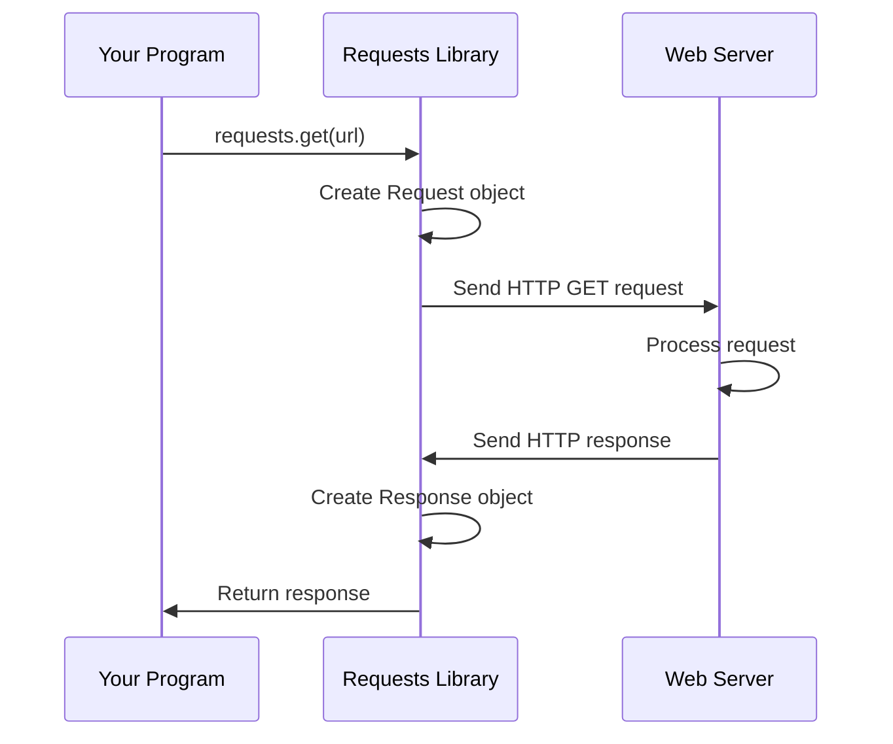

# Chapter 1: HTTP Request/Response Lifecycle

Welcome to the world of HTTP requests! If you've ever wondered how your web browser talks to websites, or how your Python programs can fetch data from the internet, you're in the right place. In this chapter, we'll learn about the fundamental cycle of making HTTP requests and receiving responses using the `requests` library.

## What Problem Does This Solve?

Imagine you want to build a Python program that checks the weather, downloads a file, or sends data to a server. To do this, your program needs to communicate with web servers over the internet. But how?

This is exactly what the HTTP Request/Response lifecycle solves. Think of it like making a phone call:
- You dial a number and say what you want (the **Request**)
- The other person processes your request
- They respond back with information (the **Response**)

Let's start with a concrete example: **fetching data from a website**.

## Your First Request

Here's the simplest possible request you can make with the `requests` library:

```python
import requests

response = requests.get('https://httpbin.org/get')
print(response.status_code)
```

**Output:** `200`

This tiny program sends a request to a test website and prints the status code. The status code `200` means "success" - like getting a thumbs up that everything worked!

Let's break down what just happened.

## Key Concepts: The Restaurant Analogy

To understand HTTP requests, let's use a restaurant analogy:

### 1. The Client (You)

You're the customer who wants something. In programming, the **client** is your Python program that needs data from a server.

### 2. The Request (Your Order)

When you place an order at a restaurant, you specify:
- **What you want**: "I'd like a pizza" (the URL you're requesting)
- **How you want it**: "GET me that data" or "POST this form" (the HTTP method)
- **Special instructions**: "Extra cheese" (headers, parameters, or data you send)

```python
import requests

# A simple GET request - asking for data
response = requests.get('https://httpbin.org/json')
```

This code is like saying: "Please GET me the data from this URL."

### 3. The Response (Your Meal)

The server processes your request and sends back a **Response**. This contains:
- **Status Code**: Did it work? (200 = yes, 404 = not found, etc.)
- **Content**: The actual data you requested
- **Headers**: Metadata about the response

```python
import requests

response = requests.get('https://httpbin.org/json')
print(f"Status: {response.status_code}")
print(f"Data type: {response.headers['Content-Type']}")
```

**Output:**
```
Status: 200
Data type: application/json
```

### 4. The Session (Your Waiter)

When you dine at a restaurant, a waiter remembers your table throughout the meal. A **Session** in requests works similarly - it remembers things across multiple requests (like cookies and authentication).

```python
import requests

session = requests.Session()
# The session remembers settings for all future requests
response = session.get('https://httpbin.org/cookies/set?name=value')
```

We'll explore sessions more in later chapters, but for now, know they make multiple requests more efficient.

## Solving Our Use Case: Fetching Data

Let's solve a real problem: getting JSON data from an API and using it.

**Step 1: Make the request**

```python
import requests

response = requests.get('https://httpbin.org/json')
```

We're asking the server to GET data from this URL.

**Step 2: Check if it worked**

```python
if response.status_code == 200:
    print("Success!")
```

Always check the status code to make sure the request succeeded.

**Step 3: Extract the data**

```python
data = response.json()
print(data)
```

The `.json()` method automatically converts the JSON response into a Python dictionary you can use.

**Complete example:**

```python
import requests

response = requests.get('https://httpbin.org/json')

if response.status_code == 200:
    data = response.json()
    print(f"We got data: {data}")
```

## How It Works Under the Hood

Let's peek behind the curtain to see what happens when you make a request:



### Step-by-Step Walkthrough

1. **You call `requests.get()`**: Your program asks the requests library to fetch data
2. **Request object is created**: The library packages up your request with all the details (URL, method, headers)
3. **HTTP request is sent**: The request travels over the internet to the server
4. **Server processes it**: The web server receives your request, does its work, and prepares data
5. **HTTP response is sent back**: The server sends the response back over the internet
6. **Response object is created**: The requests library wraps the response in a Python object
7. **You get the response**: Your program can now access the status, content, and headers

### The Request Object

When you call `requests.get()`, the library creates a Request object behind the scenes. You can also create one explicitly:

```python
from requests import Request, Session

req = Request('GET', 'https://httpbin.org/get')
```

This Request object contains:
- **method**: The HTTP method (GET, POST, etc.)
- **url**: Where to send the request
- **headers**: Additional information to send
- **data**: The body of the request (for POST/PUT)

### The Response Object

The Response object contains everything the server sent back:

```python
import requests

response = requests.get('https://httpbin.org/get')

# Status code (200, 404, etc.)
print(response.status_code)

# Raw content as bytes
print(response.content[:50])  # First 50 bytes

# Text content as string
print(response.text[:100])  # First 100 characters
```

### Behind the Scenes in Code

Let's look at what happens inside `requests.get()` (simplified from `src/requests/api.py`):

```python
def get(url, params=None, **kwargs):
    # Creates a Session for this request
    with sessions.Session() as session:
        # Session handles the actual request
        return session.request(method='get', url=url, **kwargs)
```

The function:
1. Creates a temporary Session (which manages the connection)
2. Calls `session.request()` which does the heavy lifting
3. Returns the Response object to you

## Different Types of Requests

While GET is the most common, there are other HTTP methods for different purposes:

**GET**: Retrieve data (like reading a webpage)

```python
response = requests.get('https://httpbin.org/get')
```

**POST**: Send data to create something (like submitting a form)

```python
data = {'username': 'alice', 'age': 25}
response = requests.post('https://httpbin.org/post', data=data)
```

**PUT**: Update existing data

```python
data = {'username': 'alice', 'age': 26}
response = requests.put('https://httpbin.org/put', data=data)
```

**DELETE**: Remove data

```python
response = requests.delete('https://httpbin.org/delete')
```

Each method tells the server what kind of action you want to perform.

## Practical Example: Checking a Website

Here's a complete, practical example that checks if a website is up:

```python
import requests

def is_website_up(url):
    response = requests.get(url)
    return response.status_code == 200

# Check if Python's website is up
if is_website_up('https://www.python.org'):
    print("Python.org is up!")
else:
    print("Python.org is down!")
```

This function returns `True` if the website responds successfully, `False` otherwise.

## Summary

In this chapter, you learned:

- **The Request/Response cycle**: How your program communicates with web servers
- **The Request object**: Contains what you want (URL, method, data)
- **The Response object**: Contains what you got back (status code, content, headers)
- **Basic HTTP methods**: GET for retrieving data, POST for sending data
- **How it works internally**: From creating the request to receiving the response

The requests library makes this entire process simple with just one line of code: `requests.get(url)`. But now you understand what's happening behind the scenes!

Sometimes things go wrong - the server might be down, the URL might be invalid, or the connection might timeout. In the next chapter, [Exception Hierarchy](02_exception_hierarchy_.md), we'll learn how to handle errors gracefully when making HTTP requests.

---

Generated by [AI Codebase Knowledge Builder](https://github.com/The-Pocket/Tutorial-Codebase-Knowledge)