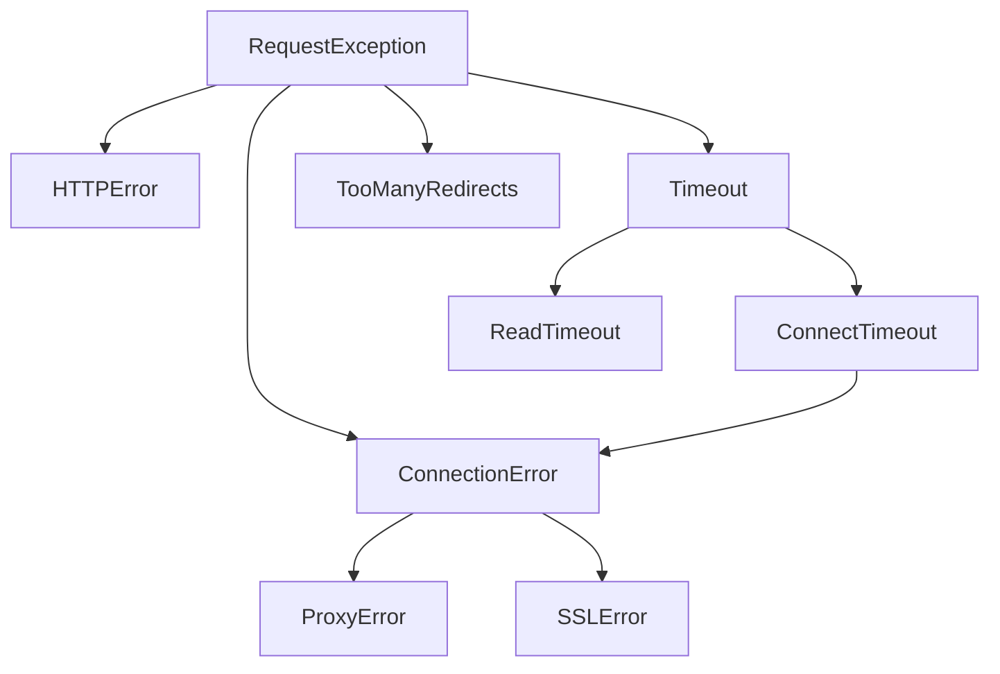
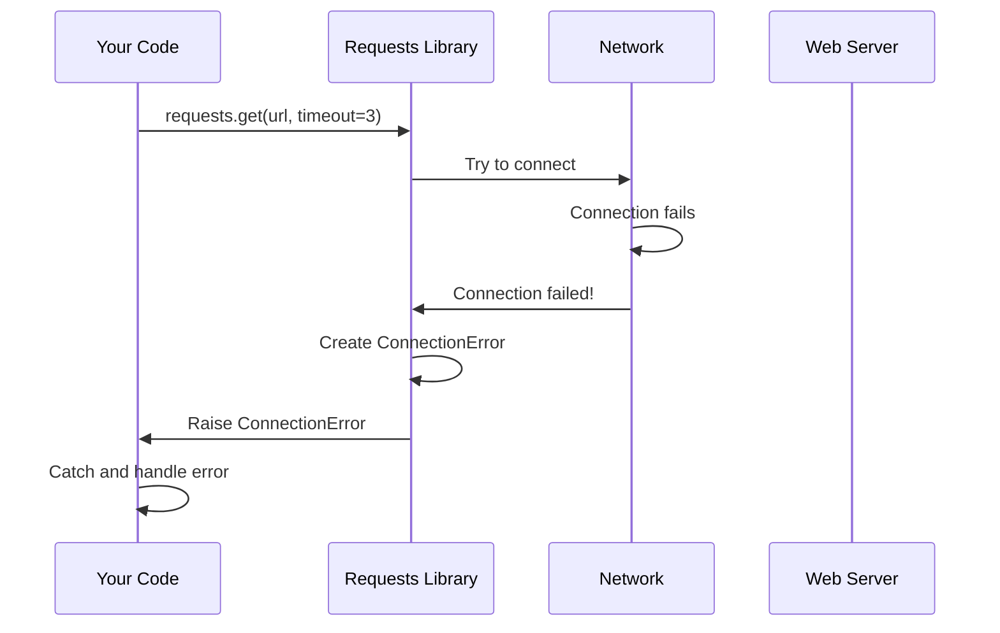

# Chapter 2: Exception Hierarchy

In [Chapter 1: HTTP Request/Response Lifecycle](01_http_request_response_lifecycle_.md), we learned how to make HTTP requests and receive responses. But what happens when things go wrong? What if the server is down, your internet connection drops, or the request takes too long? This is where exceptions come in!

## What Problem Does This Solve?

Imagine you're building a weather app that fetches data from an API. Here are some things that could go wrong:

- Your WiFi disconnects while making the request
- The weather server is down for maintenance
- The server takes too long to respond and times out
- The server returns an error (like "404 Not Found")

Without proper error handling, your app would crash with a confusing error message. The Exception Hierarchy in `requests` gives you a structured way to catch and handle these different problems gracefully.

**Our Use Case:** Let's build a simple function that tries to fetch weather data and handles different types of failures appropriately.

## Understanding the Exception Family Tree

Think of exceptions like a family tree. At the top, you have the grandparent `RequestException` - the most general error that means "something went wrong with your request." Below that, you have more specific children and grandchildren that tell you exactly what failed.

Here's the family tree:



Let's explore each member of this family!

## Key Exception Types

### 1. RequestException - The Grandparent

This is the base exception for all problems in `requests`. If you catch this, you're saying "I want to handle any error that happens during the request."

```python
import requests

try:
    response = requests.get('https://example.com')
except requests.RequestException as e:
    print(f"Something went wrong: {e}")
```

When you run this, if *anything* fails, the error is caught and printed. This is like having a safety net that catches all problems.

### 2. ConnectionError - Can't Reach the Server

This happens when your program can't connect to the server at all. Maybe your internet is down, or the server doesn't exist.

```python
import requests

try:
    response = requests.get('https://thisdoesnotexist999.com')
except requests.ConnectionError:
    print("Can't connect! Check your internet or the URL.")
```

**What happens:** The request fails immediately because there's no way to reach the server. The error is caught and you see a friendly message.

### 3. Timeout - Server Takes Too Long

When you set a timeout and the server doesn't respond in time, you get a `Timeout` exception.

```python
import requests

try:
    response = requests.get('https://httpbin.org/delay/10', timeout=3)
except requests.Timeout:
    print("Server took too long to respond!")
```

**What happens:** The request waits for 3 seconds. Since the server intentionally delays for 10 seconds, a `Timeout` is raised and caught.

### 4. HTTPError - Server Returned an Error Status

This happens when the server responds but says something went wrong (like 404 Not Found or 500 Server Error).

```python
import requests

try:
    response = requests.get('https://httpbin.org/status/404')
    response.raise_for_status()  # Raises HTTPError for bad status codes
except requests.HTTPError:
    print("Server returned an error status code!")
```

**What happens:** The server responds with status 404. Calling `raise_for_status()` checks the status code and raises `HTTPError` if it's an error.

## Solving Our Use Case: A Robust Weather Fetcher

Now let's build our weather app with proper error handling. We'll handle different failures differently:

**Step 1: Try to make the request**

```python
import requests

def get_weather(city):
    url = f'https://api.weather.example.com/{city}'
    try:
        response = requests.get(url, timeout=5)
```

We start by attempting the request with a 5-second timeout.

**Step 2: Check for timeout errors**

```python
    except requests.Timeout:
        return "Weather service is slow. Try again later."
```

If the server is too slow, we return a helpful message.

**Step 3: Check for connection errors**

```python
    except requests.ConnectionError:
        return "Can't reach weather service. Check your internet."
```

If we can't connect at all, we tell the user to check their connection.

**Step 4: Check for HTTP errors**

```python
    except requests.HTTPError:
        return "Weather service returned an error."
```

If the server responds with an error status, we catch it here.

**Step 5: Catch any other problems**

```python
    except requests.RequestException:
        return "Something unexpected went wrong."
```

This catches anything else that might happen.

**Step 6: Return the data if everything worked**

```python
    else:
        return response.json()
```

If no exception was raised, we return the weather data!

**Complete function:**

```python
import requests

def get_weather(city):
    url = f'https://api.weather.example.com/{city}'
    try:
        response = requests.get(url, timeout=5)
        response.raise_for_status()
    except requests.Timeout:
        return "Weather service is slow. Try again later."
    except requests.ConnectionError:
        return "Can't reach weather service. Check your internet."
    except requests.HTTPError:
        return "Weather service returned an error."
    except requests.RequestException:
        return "Something unexpected went wrong."
    else:
        return response.json()
```

## The Hierarchy Advantage: Catching Multiple Exceptions

The beauty of the hierarchy is you can catch broad or specific errors. Think of it like catching fish with different sized nets:

### Specific Catches (Small Net)

```python
import requests

try:
    response = requests.get('https://httpbin.org/delay/10', timeout=3)
except requests.ConnectTimeout:
    print("Couldn't connect in time")
except requests.ReadTimeout:
    print("Connected but reading took too long")
```

This catches two specific timeout types separately.

### General Catches (Big Net)

```python
import requests

try:
    response = requests.get('https://httpbin.org/delay/10', timeout=3)
except requests.Timeout:
    print("Some kind of timeout happened")
```

This catches *both* `ConnectTimeout` and `ReadTimeout` because they're both children of `Timeout`.

### The Order Matters!

Always catch specific exceptions **before** general ones:

```python
import requests

try:
    response = requests.get('https://example.com')
except requests.ConnectTimeout:  # Specific first
    print("Connection timeout")
except requests.Timeout:  # Then more general
    print("Some other timeout")
except requests.RequestException:  # Most general last
    print("Some other error")
```

If you put `RequestException` first, it would catch everything and the specific handlers would never run!

## How It Works Under the Hood

Let's see what happens when you make a request and an error occurs:



**Step-by-step walkthrough:**

1. **You call `requests.get()`**: Your code asks requests to fetch data
2. **Requests tries to connect**: The library attempts to reach the server
3. **Network fails**: Something goes wrong (no internet, server down, etc.)
4. **Network reports failure**: The underlying network layer reports the problem
5. **Requests creates an exception**: Based on the type of failure, requests creates the appropriate exception (like `ConnectionError`)
6. **Exception is raised**: The exception is raised and control returns to your code
7. **You catch and handle**: Your `except` block catches it and handles it gracefully

### Inside the Exception Classes

Let's look at how these exceptions are defined in `src/requests/exceptions.py`:

**The base exception:**

```python
class RequestException(IOError):
    """There was an ambiguous exception that occurred 
    while handling your request."""
    
    def __init__(self, *args, **kwargs):
        response = kwargs.pop("response", None)
        self.response = response
        self.request = kwargs.pop("request", None)
```

`RequestException` inherits from Python's built-in `IOError`. It stores both the `request` and `response` objects so you can inspect what went wrong.

**A specific child exception:**

```python
class ConnectionError(RequestException):
    """A Connection error occurred."""
```

Notice how `ConnectionError` inherits from `RequestException`. This means catching `RequestException` will also catch `ConnectionError`!

**A grandchild exception:**

```python
class ProxyError(ConnectionError):
    """A proxy error occurred."""
```

`ProxyError` inherits from `ConnectionError`, which inherits from `RequestException`. It's three generations deep!

### Where Exceptions Are Raised

Let's look at where these exceptions actually get raised. In `src/requests/adapters.py`, when sending a request:

```python
try:
    resp = conn.urlopen(
        method=request.method,
        url=url,
        # ... other parameters
    )
except MaxRetryError as e:
    if isinstance(e.reason, ConnectTimeoutError):
        raise ConnectTimeout(e, request=request)
```

When the underlying `urllib3` library raises a `MaxRetryError` with a `ConnectTimeoutError` reason, `requests` translates it into its own `ConnectTimeout` exception.

**Another example:**

```python
except (ProtocolError, OSError) as err:
    raise ConnectionError(err, request=request)
```

Low-level protocol errors or OS errors are caught and converted to the friendlier `ConnectionError`.

## Practical Exception Handling Patterns

### Pattern 1: Log and Retry

```python
import requests
import time

def fetch_with_retry(url, retries=3):
    for attempt in range(retries):
        try:
            return requests.get(url, timeout=5)
        except requests.ConnectionError:
            print(f"Attempt {attempt + 1} failed. Retrying...")
            time.sleep(2)
    return None  # All retries failed
```

This tries the request up to 3 times if there's a connection error.

### Pattern 2: Different Actions for Different Errors

```python
import requests

def smart_fetch(url):
    try:
        response = requests.get(url, timeout=5)
        response.raise_for_status()
        return response.json()
    except requests.Timeout:
        # For timeouts, we might want to retry later
        return {"error": "timeout", "retry": True}
    except requests.HTTPError as e:
        # For HTTP errors, don't retry
        return {"error": "http", "retry": False, "status": e.response.status_code}
    except requests.RequestException:
        # For other errors, log and return None
        print("Unexpected error occurred")
        return None
```

Different error types trigger different responses.

### Pattern 3: Accessing Error Details

```python
import requests

try:
    response = requests.get('https://httpbin.org/status/500')
    response.raise_for_status()
except requests.HTTPError as e:
    print(f"Status code: {e.response.status_code}")
    print(f"URL: {e.request.url}")
    print(f"Response text: {e.response.text}")
```

The exception objects contain the `request` and `response`, so you can inspect details about what went wrong.

## Special Exceptions to Know

### TooManyRedirects

When a URL redirects you too many times (possible infinite loop):

```python
import requests

try:
    response = requests.get('https://httpbin.org/redirect/100')
except requests.TooManyRedirects:
    print("Page redirected too many times!")
```

### SSLError

When there's a problem with SSL/TLS certificates:

```python
import requests

try:
    response = requests.get('https://expired.badssl.com/')
except requests.SSLError:
    print("SSL certificate problem!")
```

## Summary

In this chapter, you learned:

- **Exception Hierarchy**: How exceptions are organized in a family tree from general (`RequestException`) to specific (`ConnectTimeout`)
- **Key Exception Types**: `ConnectionError`, `Timeout`, `HTTPError`, and their children
- **Catching Exceptions**: How to use `try/except` blocks to handle different failures
- **The Order Matters**: Always catch specific exceptions before general ones
- **Practical Patterns**: How to retry requests, handle different errors differently, and access error details
- **Under the Hood**: How `requests` translates low-level errors into friendly exception types

Exception handling makes your programs robust and user-friendly. Instead of crashing with confusing errors, you can provide helpful messages and take appropriate actions when things go wrong.

Now that you know how to handle errors, you might wonder how to send credentials when making requests to protected APIs. In the next chapter, [Authentication Handlers](03_authentication_handlers_.md), we'll learn how `requests` makes it easy to authenticate your requests!

---

Generated by [AI Codebase Knowledge Builder](https://github.com/The-Pocket/Tutorial-Codebase-Knowledge)