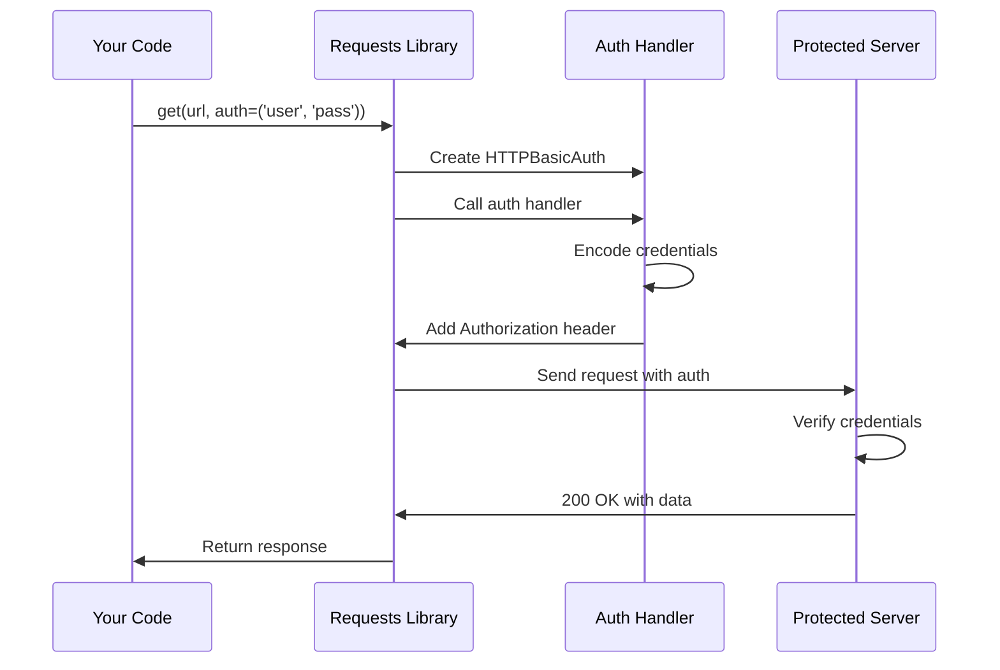
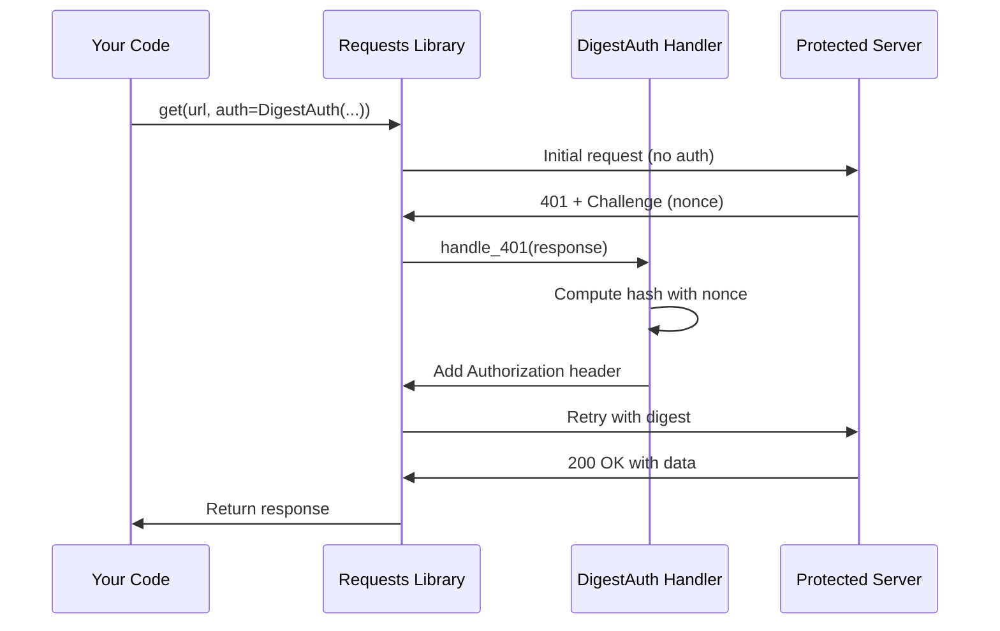

# Chapter 3: Authentication Handlers

In [Chapter 2: Exception Hierarchy](02_exception_hierarchy_.md), we learned how to handle errors gracefully when things go wrong with our HTTP requests. But what about accessing protected resources that require you to prove who you are? Many websites and APIs don't just let anyone access their data - they need you to authenticate first. This is where authentication handlers come in!

## What Problem Does This Solve?

Imagine you're building a program that needs to access your company's internal API. The API won't just give data to anyone who asks - it requires you to prove you're authorized. You might need to:

- Send your username and password to access protected resources
- Authenticate with a more secure method that doesn't expose your password
- Add special authentication headers to every request

Without authentication handlers, you'd have to manually construct these authentication headers, encode credentials properly, and add them to each request. That's tedious and error-prone!

**Our Use Case:** Let's build a simple program that fetches data from a protected API that requires Basic Authentication (username and password).

## Understanding Authentication: The ID Badge Analogy

Think of authentication like entering a secure building:

### No Authentication (Open Door)
Some buildings let anyone walk in - no ID needed. Similarly, some websites are completely public:

```python
import requests

response = requests.get('https://httpbin.org/json')
print(response.status_code)  # 200 - Success!
```

### Basic Authentication (Simple ID Badge)
Other buildings require you to show an ID badge with your name. Basic Auth is like showing your username and password together:

```python
import requests

response = requests.get(
    'https://httpbin.org/basic-auth/alice/secret123',
    auth=('alice', 'secret123')
)
print(response.status_code)  # 200 - Authenticated!
```

The `auth` parameter is an authentication handler - it automatically adds the right credentials to your request!

### Digest Authentication (Secure Handshake)
Some buildings use advanced security systems that verify your identity without you showing your actual ID card directly. Digest Auth works similarly - it proves you know the password without sending it in plain text.

## Key Concepts: Types of Authentication Handlers

Let's explore the different authentication methods `requests` provides.

### 1. HTTPBasicAuth - Username and Password

Basic Auth is the simplest form. You provide a username and password, and they're sent with every request (encoded, but not encrypted).

**Simple way (automatic):**

```python
import requests

response = requests.get(
    'https://httpbin.org/basic-auth/john/mypassword',
    auth=('john', 'mypassword')
)
```

When you pass a tuple `(username, password)` to the `auth` parameter, `requests` automatically uses Basic Authentication!

**Explicit way (manual):**

```python
from requests.auth import HTTPBasicAuth
import requests

auth_handler = HTTPBasicAuth('john', 'mypassword')
response = requests.get(
    'https://httpbin.org/basic-auth/john/mypassword',
    auth=auth_handler
)
```

Both ways work identically - the second is more explicit about what's happening.

### 2. HTTPDigestAuth - More Secure Authentication

Digest Auth is more sophisticated. Instead of sending your password directly, it uses a cryptographic "handshake" to prove you know the password without revealing it.

```python
from requests.auth import HTTPDigestAuth
import requests

auth_handler = HTTPDigestAuth('alice', 'secretpass')
response = requests.get(
    'https://httpbin.org/digest-auth/auth/alice/secretpass',
    auth=auth_handler
)
print(response.status_code)  # 200 - Success!
```

The server sends a challenge, and your client responds with a computed hash. Much more secure!

### 3. Custom Authentication - Build Your Own

Some APIs use custom authentication (like API keys in headers). You can create your own auth handler:

```python
from requests.auth import AuthBase

class APIKeyAuth(AuthBase):
    def __init__(self, api_key):
        self.api_key = api_key
    
    def __call__(self, request):
        request.headers['X-API-Key'] = self.api_key
        return request
```

```python
import requests

auth = APIKeyAuth('my-secret-key-12345')
response = requests.get('https://api.example.com/data', auth=auth)
```

The auth handler automatically adds your API key to the headers!

## Solving Our Use Case: Accessing Protected Data

Let's solve our original problem: fetching data from a protected API.

**Step 1: Identify the authentication type**

The API documentation tells us it uses Basic Authentication with username `user` and password `pass123`.

**Step 2: Create the request with authentication**

```python
import requests

response = requests.get(
    'https://httpbin.org/basic-auth/user/pass123',
    auth=('user', 'pass123')
)
```

That's it! The `auth` parameter handles everything.

**Step 3: Check and use the response**

```python
if response.status_code == 200:
    data = response.json()
    print(f"Successfully authenticated! Data: {data}")
else:
    print(f"Authentication failed: {response.status_code}")
```

**Complete example:**

```python
import requests

url = 'https://httpbin.org/basic-auth/user/pass123'
response = requests.get(url, auth=('user', 'pass123'))

if response.status_code == 200:
    print("✓ Authenticated successfully!")
    print(f"Response: {response.json()}")
```

**Output:**
```
✓ Authenticated successfully!
Response: {'authenticated': True, 'user': 'user'}
```

## How It Works Under the Hood

Let's see what happens when you use an authentication handler:



### Step-by-Step Walkthrough: Basic Auth

1. **You provide credentials**: You pass `auth=('user', 'pass')` to `requests.get()`
2. **Auth handler is created**: `requests` creates an `HTTPBasicAuth` object with your credentials
3. **Request is prepared**: The request object is built with the URL and other parameters
4. **Auth handler is called**: The auth handler's `__call__` method is invoked with the request
5. **Headers are added**: The auth handler encodes your credentials and adds an `Authorization` header
6. **Request is sent**: The modified request (now with auth headers) is sent to the server
7. **Server verifies**: The server checks the credentials
8. **Response returned**: If valid, the server sends back the protected data

### Step-by-Step Walkthrough: Digest Auth

Digest Auth is more complex - it requires two round trips:



1. **First request**: Sent without authentication
2. **Server challenges**: Server responds with `401 Unauthorized` and a random "nonce" (number used once)
3. **Compute response**: The auth handler combines the nonce, username, password, and URL to create a hash
4. **Second request**: Sent with the computed hash
5. **Server verifies**: Server performs the same calculation and compares
6. **Success**: If hashes match, server returns the data

## Inside the Code: How Auth Handlers Work

Let's look at how authentication handlers are implemented in the `requests` library.

### The Base Class: AuthBase

All auth handlers inherit from `AuthBase` (from `src/requests/auth.py`):

```python
class AuthBase:
    def __call__(self, r):
        raise NotImplementedError('Auth hooks must be callable.')
```

This is the blueprint. Every auth handler must be callable (implement `__call__`) and modify the request `r`.

### HTTPBasicAuth Implementation

Here's how Basic Auth works (simplified from `src/requests/auth.py`):

```python
class HTTPBasicAuth(AuthBase):
    def __init__(self, username, password):
        self.username = username
        self.password = password
```

The constructor stores your credentials.

```python
    def __call__(self, r):
        r.headers['Authorization'] = _basic_auth_str(
            self.username, 
            self.password
        )
        return r
```

When called, it adds the `Authorization` header to the request and returns the modified request.

### Encoding Credentials

The `_basic_auth_str` function encodes your credentials:

```python
def _basic_auth_str(username, password):
    # Convert to bytes if needed
    if isinstance(username, str):
        username = username.encode('latin1')
    if isinstance(password, str):
        password = password.encode('latin1')
    
    # Combine and encode
    combined = b':'.join((username, password))
    encoded = b64encode(combined).strip()
    
    return 'Basic ' + encoded.decode('ascii')
```

This creates a string like `"Basic dXNlcjpwYXNzMTIz"` where the part after "Basic" is the base64-encoded `username:password`.

### Where Auth Handlers Are Applied

When you call `requests.get(url, auth=...)`, the authentication happens in the `prepare_auth` method (from `src/requests/models.py`):

```python
def prepare_auth(self, auth, url=''):
    if auth is None:
        # Extract auth from URL if present
        url_auth = get_auth_from_url(self.url)
        # ...
    else:
        if callable(auth):
            # Call the auth handler!
            self = auth(self)
```

If you provide an `auth` parameter and it's callable (like our auth handlers), it's called with `self` (the PreparedRequest), and it modifies the request by adding headers.

### HTTPDigestAuth: The Complex Case

Digest Auth is more sophisticated (simplified from `src/requests/auth.py`):

```python
class HTTPDigestAuth(AuthBase):
    def __init__(self, username, password):
        self.username = username
        self.password = password
        self._thread_local = threading.local()
```

It uses thread-local storage to remember state across requests.

```python
    def handle_401(self, r, **kwargs):
        # If server sent 401 with digest challenge
        if 'digest' in r.headers.get('www-authenticate', ''):
            # Parse the challenge
            # Compute the response hash
            # Prepare new request with digest
            # Send it again
            return new_response
        return r
```

The `handle_401` method is registered as a response hook. When a `401` response comes back, it computes the digest and retries.

## Practical Authentication Patterns

### Pattern 1: Reusing Auth Across Multiple Requests

Instead of passing `auth` to every request, use a Session:

```python
import requests
from requests.auth import HTTPBasicAuth

session = requests.Session()
session.auth = HTTPBasicAuth('user', 'password')

# All requests in this session use the auth
response1 = session.get('https://httpbin.org/basic-auth/user/password')
response2 = session.get('https://httpbin.org/headers')
```

The session remembers your authentication!

### Pattern 2: Custom API Key Authentication

Many modern APIs use API keys in headers:

```python
from requests.auth import AuthBase

class BearerAuth(AuthBase):
    def __init__(self, token):
        self.token = token
    
    def __call__(self, r):
        r.headers['Authorization'] = f'Bearer {self.token}'
        return r
```

```python
import requests

auth = BearerAuth('eyJhbGciOiJIUzI1NiIsInR5cCI6IkpXVCJ9...')
response = requests.get('https://api.example.com/user', auth=auth)
```

This adds `Authorization: Bearer <token>` to your requests.

### Pattern 3: Fallback Authentication

Handle authentication failures gracefully:

```python
import requests
from requests.auth import HTTPBasicAuth

def fetch_protected_data(url, username, password):
    try:
        auth = HTTPBasicAuth(username, password)
        response = requests.get(url, auth=auth)
        response.raise_for_status()
        return response.json()
    except requests.HTTPError as e:
        if e.response.status_code == 401:
            return {"error": "Invalid credentials"}
        raise
```

This catches authentication failures and returns a friendly message.

## Comparing Authentication Methods

| Method | Security | Use Case | Complexity |
|--------|----------|----------|------------|
| **Basic Auth** | Low (credentials sent every time) | Simple APIs, internal tools | Very simple |
| **Digest Auth** | Medium (password never sent) | APIs needing better security | Moderate |
| **Custom (API Key)** | Varies | Modern REST APIs | Simple |
| **OAuth** | High (token-based) | Third-party access | Complex (not built into requests) |

## Summary

In this chapter, you learned:

- **Authentication handlers**: Objects that automatically add credentials to your requests
- **HTTPBasicAuth**: The simplest method - sends username and password (encoded)
- **HTTPDigestAuth**: More secure - uses cryptographic hashing without sending the password
- **Custom auth handlers**: You can create your own by inheriting from `AuthBase`
- **How it works**: Auth handlers are called before sending the request and modify headers
- **Sessions with auth**: Reuse authentication across multiple requests
- **The two-request flow**: Digest Auth makes an initial request, gets challenged, then retries with proper credentials

Authentication handlers make it incredibly easy to work with protected APIs. Instead of manually constructing authentication headers, you just pass `auth=('username', 'password')` and `requests` handles everything!

Now that you can authenticate your requests, you might wonder how `requests` remembers information across multiple requests to the same server. Cookies are the answer! In the next chapter, [Cookie Management](04_cookie_management_.md), we'll learn how `requests` automatically handles cookies to maintain state across requests.

---

Generated by [AI Codebase Knowledge Builder](https://github.com/The-Pocket/Tutorial-Codebase-Knowledge)