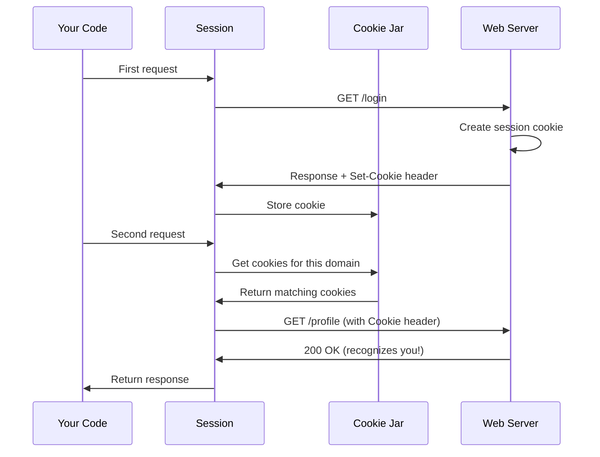

# Chapter 4: Cookie Management

In [Chapter 3: Authentication Handlers](03_authentication_handlers_.md), we learned how to authenticate ourselves to access protected resources. But there's another way websites remember who you are: **cookies**! When you log into a website and it "remembers" you on your next visit, that's cookies at work.

## What Problem Does This Solve?

Imagine you're building a program that needs to:

- Log into a website and then browse multiple pages while staying logged in
- Make several requests where the server needs to remember information between requests
- Shop online where your cart persists as you browse

Without cookie management, you'd have to manually extract cookies from each response, store them, and remember to include the right cookies in future requests. It's like trying to juggle loyalty cards from different stores - you need to know which card works where!

**Our Use Case:** Let's build a simple program that logs into a website (which sets a session cookie) and then accesses a protected page using that cookie.

## Understanding Cookies: The Loyalty Card Analogy

Think of cookies like loyalty cards at your favorite stores:

### The Store Gives You a Card

When you visit a store for the first time and sign up for their program, they give you a loyalty card with a unique number:

```python
import requests

# First visit - the server gives us a cookie
response = requests.get('https://httpbin.org/cookies/set?session=abc123')
print(response.cookies)
```

**Output:** `<RequestsCookieJar[Cookie(name='session', value='abc123')]>`

The server sent us a cookie named `session` with the value `abc123`!

### Your Wallet Stores the Cards

You keep all your loyalty cards in your wallet so you can use them later. Similarly, `requests` stores cookies in a **RequestsCookieJar** - it's like a wallet for cookies:

```python
import requests

response = requests.get('https://httpbin.org/cookies/set?user=alice')
# The jar automatically stores the cookie
jar = response.cookies
print(jar['user'])
```

**Output:** `'alice'`

### The Store Recognizes You Next Time

When you return to the store, you show your loyalty card and they know who you are. When you make another request, `requests` automatically includes the right cookies:

```python
import requests

session = requests.Session()
# First request sets a cookie
session.get('https://httpbin.org/cookies/set?session=xyz789')

# Second request automatically sends the cookie!
response = session.get('https://httpbin.org/cookies')
print(response.json())
```

**Output:** 
```
{'cookies': {'session': 'xyz789'}}
```

The server received our cookie and recognized us!

### Different Cards for Different Stores

You wouldn't use your grocery store card at the pharmacy. Cookies work the same way - each cookie belongs to a specific domain:

```python
import requests

jar = requests.cookies.RequestsCookieJar()
jar.set('shopping_cart', 'item1', domain='store.com')
jar.set('user_id', '42', domain='social.com')

print(f"Store.com cookies: {jar.get('shopping_cart', domain='store.com')}")
print(f"Social.com cookies: {jar.get('user_id', domain='social.com')}")
```

**Output:**
```
Store.com cookies: item1
Social.com cookies: 42
```

## Key Concepts: The Cookie Jar

Let's explore the main tool for cookie management: **RequestsCookieJar**.

### 1. Automatic Cookie Handling

The simplest way to use cookies is to let `requests` handle everything automatically:

```python
import requests

session = requests.Session()
# Server sets a cookie
session.get('https://httpbin.org/cookies/set/flavor/chocolate')

# Future requests include the cookie automatically
response = session.get('https://httpbin.org/cookies')
print(response.json()['cookies'])
```

**Output:** `{'flavor': 'chocolate'}`

You don't need to do anything - the session remembers and sends cookies automatically!

### 2. Accessing Cookies Like a Dictionary

RequestsCookieJar lets you access cookies as if it were a dictionary:

```python
import requests

response = requests.get('https://httpbin.org/cookies/set?name=Bob')
cookies = response.cookies

# Dictionary-style access
print(cookies['name'])
# Or use .get() for safety
print(cookies.get('age', 'not set'))
```

**Output:**
```
Bob
not set
```

### 3. Setting Cookies Manually

You can create and set cookies yourself:

```python
import requests

jar = requests.cookies.RequestsCookieJar()
jar.set('username', 'alice')
jar.set('theme', 'dark')

# Use the jar in a request
response = requests.get('https://httpbin.org/cookies', cookies=jar)
print(response.json()['cookies'])
```

**Output:** `{'username': 'alice', 'theme': 'dark'}`

### 4. Domain and Path Specificity

Cookies can be specific to certain domains and paths (like different sections of a store):

```python
from requests.cookies import RequestsCookieJar

jar = RequestsCookieJar()
# Cookie only for example.com/shop
jar.set('cart', 'item1', domain='example.com', path='/shop')
# Cookie for all of example.com
jar.set('user', 'bob', domain='example.com')

print(f"Shop cart: {jar.get('cart', domain='example.com', path='/shop')}")
print(f"User: {jar.get('user', domain='example.com')}")
```

**Output:**
```
Shop cart: item1
User: bob
```

## Solving Our Use Case: Staying Logged In

Now let's solve our original problem: logging in and accessing protected pages.

**Step 1: Create a session (our cookie wallet)**

```python
import requests

session = requests.Session()
```

A Session automatically manages cookies across multiple requests.

**Step 2: Log in (receive the session cookie)**

```python
# Simulate login - server sets a session cookie
login_response = session.post(
    'https://httpbin.org/cookies/set',
    data={'session_id': 'secret-token-123'}
)
```

When we "log in," the server gives us a session cookie that proves we're authenticated.

**Step 3: Access protected pages (automatically send the cookie)**

```python
# Access a protected resource - cookie is sent automatically
protected_response = session.get('https://httpbin.org/cookies')
print(protected_response.json()['cookies'])
```

**Output:** `{'session_id': 'secret-token-123'}`

The session automatically included our login cookie!

**Complete example:**

```python
import requests

# Create a session
session = requests.Session()

# Step 1: Login (get session cookie)
session.get('https://httpbin.org/cookies/set?logged_in=true')

# Step 2: Access protected page
response = session.get('https://httpbin.org/cookies')

# Check that we're still logged in
if response.json()['cookies'].get('logged_in') == 'true':
    print("✓ Successfully stayed logged in!")
    print(f"Cookies: {response.json()['cookies']}")
```

**Output:**
```
✓ Successfully stayed logged in!
Cookies: {'logged_in': 'true'}
```

## How It Works Under the Hood

Let's see what happens when you make requests with cookies:



### Step-by-Step Walkthrough

Let's trace what happens when you use a session with cookies:

**1. First request is made:**
```python
session.get('https://example.com/login')
```

**2. Server responds with Set-Cookie header:**
The server includes something like: `Set-Cookie: session_id=abc123`

**3. Cookie is extracted and stored:**
The `Session` automatically extracts cookies from the response headers and stores them in its internal `RequestsCookieJar`.

**4. Second request is prepared:**
```python
session.get('https://example.com/profile')
```

**5. Cookies are retrieved:**
The `Session` asks its cookie jar: "Which cookies should I send to example.com?"

**6. Cookie header is added:**
The jar returns the matching cookies, and they're added to the request as: `Cookie: session_id=abc123`

**7. Request is sent:**
The request goes to the server with the cookie included.

**8. Server recognizes you:**
The server sees the `session_id` cookie and knows who you are!

## Inside the Code: How Cookie Jars Work

Let's explore the implementation of cookie management.

### The RequestsCookieJar Class

The `RequestsCookieJar` is defined in `src/requests/cookies.py`. Here's what it looks like (simplified):

```python
class RequestsCookieJar(CookieJar, MutableMapping):
    """A CookieJar that also works like a dictionary."""
    
    def get(self, name, default=None, domain=None, path=None):
        """Get a cookie value like a dictionary."""
        try:
            return self._find_no_duplicates(name, domain, path)
        except KeyError:
            return default
```

It inherits from Python's standard `CookieJar` but adds dictionary-like access!

### Dictionary-Style Access

When you do `cookies['name']`, here's what happens:

```python
def __getitem__(self, name):
    """Get cookie by name like a dictionary."""
    return self._find_no_duplicates(name)

def _find_no_duplicates(self, name, domain=None, path=None):
    """Find a cookie, ensuring there's only one match."""
    toReturn = None
    for cookie in iter(self):
        if cookie.name == name:
            # Check domain and path match
            if domain is None or cookie.domain == domain:
                if path is None or cookie.path == path:
                    if toReturn is not None:
                        raise CookieConflictError("Multiple cookies!")
                    toReturn = cookie.value
    
    if toReturn is not None:
        return toReturn
    raise KeyError(f"Cookie {name} not found")
```

It searches through all cookies to find one matching your criteria. If there are multiple matches (from different domains), it raises an error!

### Setting Cookies

When you do `jar.set('name', 'value')`:

```python
def set(self, name, value, **kwargs):
    """Set a cookie value."""
    if value is None:
        # None means delete the cookie
        remove_cookie_by_name(self, name, **kwargs)
        return
    
    # Create a proper Cookie object
    c = create_cookie(name, value, **kwargs)
    self.set_cookie(c)
    return c
```

It creates a proper `Cookie` object with all the necessary attributes (domain, path, expiration, etc.).

### Creating Cookie Objects

The `create_cookie` function builds a complete cookie:

```python
def create_cookie(name, value, **kwargs):
    """Make a cookie from simple parameters."""
    result = {
        'version': 0,
        'name': name,
        'value': value,
        'domain': '',  # Empty domain = any domain
        'path': '/',   # Root path = any path
        'secure': False,
        'expires': None,
        # ... more attributes
    }
    
    result.update(kwargs)  # Override with provided values
    return cookielib.Cookie(**result)
```

By default, cookies work everywhere (empty domain, root path), but you can specify restrictions.

### Extracting Cookies from Responses

When a response comes back, cookies are extracted in `extract_cookies_to_jar` (from `src/requests/cookies.py`):

```python
def extract_cookies_to_jar(jar, request, response):
    """Extract cookies from response into the jar."""
    if not response._original_response:
        return
    
    # Wrap our request to look like urllib expects
    req = MockRequest(request)
    # Wrap response headers
    res = MockResponse(response._original_response.msg)
    # Let Python's cookiejar parse Set-Cookie headers
    jar.extract_cookies(res, req)
```

It uses Python's standard cookie parsing, but wraps our `requests` objects to make them compatible.

### Adding Cookies to Requests

When making a request, cookies are added in `get_cookie_header`:

```python
def get_cookie_header(jar, request):
    """Get the Cookie header string for this request."""
    r = MockRequest(request)
    # Let the jar add appropriate cookies
    jar.add_cookie_header(r)
    # Extract the Cookie header that was added
    return r.get_new_headers().get('Cookie')
```

The jar knows which cookies apply to this specific request based on domain and path rules.

### Where Cookies Are Used in Sessions

In the `Session` class (from `src/requests/sessions.py`), cookies are managed automatically:

```python
class Session:
    def __init__(self):
        # Each session has its own cookie jar
        self.cookies = cookiejar_from_dict({})
    
    def request(self, method, url, **kwargs):
        # Merge request-specific cookies with session cookies
        cookies = merge_cookies(
            self.cookies, 
            kwargs.get('cookies')
        )
        # ... prepare and send request ...
        # Extract cookies from response
        extract_cookies_to_jar(
            self.cookies, 
            prepared_request, 
            response
        )
```

Every session maintains its own jar, merging in any request-specific cookies you provide.

## Practical Cookie Patterns

### Pattern 1: Inspecting All Cookies

See all cookies in your jar:

```python
import requests

session = requests.Session()
session.get('https://httpbin.org/cookies/set?a=1')
session.get('https://httpbin.org/cookies/set?b=2')

# Iterate through all cookies
for cookie in session.cookies:
    print(f"{cookie.name} = {cookie.value}")
```

**Output:**
```
a = 1
b = 2
```

### Pattern 2: Saving and Loading Cookies

Persist cookies between program runs:

```python
import requests
import pickle

# Save cookies to a file
session = requests.Session()
session.get('https://httpbin.org/cookies/set?user=alice')

with open('cookies.pkl', 'wb') as f:
    pickle.dump(session.cookies, f)

# Load cookies later
new_session = requests.Session()
with open('cookies.pkl', 'rb') as f:
    new_session.cookies = pickle.load(f)

# Continue where you left off!
response = new_session.get('https://httpbin.org/cookies')
print(response.json()['cookies'])
```

**Output:** `{'user': 'alice'}`

### Pattern 3: Converting Between Dictionaries and Cookie Jars

Sometimes you need to work with plain dictionaries:

```python
from requests.cookies import cookiejar_from_dict

# From dict to jar
cookie_dict = {'session': 'xyz', 'theme': 'dark'}
jar = cookiejar_from_dict(cookie_dict)

# From jar to dict
response = requests.get('https://httpbin.org/cookies', cookies=jar)
cookies_back = response.cookies.get_dict()
print(cookies_back)
```

**Output:** `{'session': 'xyz', 'theme': 'dark'}`

### Pattern 4: Removing Specific Cookies

Delete cookies when you're done:

```python
from requests.cookies import remove_cookie_by_name

jar = requests.cookies.RequestsCookieJar()
jar.set('keep_me', 'important')
jar.set('delete_me', 'temporary')

# Remove one cookie
remove_cookie_by_name(jar, 'delete_me')

print(dict(jar))
```

---

Generated by [AI Codebase Knowledge Builder](https://github.com/The-Pocket/Tutorial-Codebase-Knowledge)