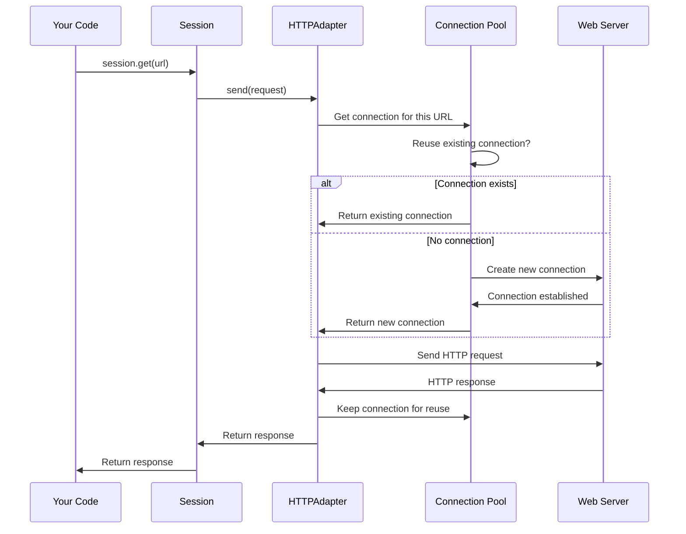

# Chapter 5: Transport Adapters

In [Chapter 4: Cookie Management](04_cookie_management_.md), we learned how `requests` remembers information between requests using cookies. But have you ever wondered how the actual HTTP request travels across the internet to reach the server? Or how `requests` manages to reuse connections efficiently? That's where **Transport Adapters** come in!

## What Problem Does This Solve?

Imagine you're building a program that needs to make hundreds of requests to the same API server. Without transport adapters, you'd face these challenges:

- **Slow performance**: Creating a new connection for every single request is slow
- **Certificate verification headaches**: Manually handling SSL/TLS certificates is complex
- **No retry logic**: If a connection fails, you have to implement retry logic yourself
- **Proxy configuration**: Setting up proxies for corporate networks is tedious

**Our Use Case:** Let's say you're building a weather monitoring system that fetches data from an API every minute. You want it to be fast (reuse connections), reliable (retry on failures), and secure (verify SSL certificates). Transport adapters handle all of this automatically!

## Understanding Transport Adapters: The Postal Service Analogy

Think of making an HTTP request like sending a package:

### You Write the Letter (Prepare the Request)

You decide what you want to say and package it up:

```python
import requests

# You prepare what you want to send
response = requests.get('https://api.weather.com/forecast')
```

This is just you saying "I want data from this URL."

### Different Delivery Services (Different Adapters)

Just like you might choose between USPS, FedEx, or DHL, you can choose different transport adapters to actually send your request. Each service has different features:

- **HTTPAdapter** (the default): Like USPS - reliable, handles most cases, reuses trucks (connections)
- **Custom Adapter**: Like a specialized courier service for specific needs

```python
import requests
from requests.adapters import HTTPAdapter

session = requests.Session()
# Mount a specific "delivery service" for HTTP requests
adapter = HTTPAdapter()
session.mount('http://', adapter)
```

The adapter is the postal service that physically delivers your request!

### Connection Pooling (Reusing Delivery Trucks)

Imagine if FedEx bought a new truck for every package - that would be wasteful! Instead, they reuse trucks for multiple deliveries. HTTPAdapter does the same with network connections:

```python
import requests
from requests.adapters import HTTPAdapter

session = requests.Session()
# This adapter can reuse up to 10 connections
adapter = HTTPAdapter(pool_connections=10, pool_maxsize=10)
session.mount('https://', adapter)

# These requests reuse the same connection!
session.get('https://api.weather.com/forecast')
session.get('https://api.weather.com/current')
```

**What happens:** The first request creates a connection. The second request reuses it instead of creating a new one. Much faster!

## Key Concepts: Understanding HTTPAdapter

Let's break down the main features of the HTTPAdapter, the default transport adapter.

### 1. Connection Pooling - Speed Through Reuse

Creating a new network connection takes time (like warming up a car engine). Connection pooling keeps connections "warm" and ready:

```python
from requests.adapters import HTTPAdapter
import requests

session = requests.Session()
# Keep 5 connection pools, each with up to 20 connections
adapter = HTTPAdapter(pool_connections=5, pool_maxsize=20)
session.mount('https://', adapter)
```

**What this means:**
- `pool_connections=5`: Remember connections to 5 different servers
- `pool_maxsize=20`: Keep up to 20 reusable connections per server

### 2. Retry Logic - Automatic Second Chances

Sometimes networks hiccup. Adapters can automatically retry failed requests:

```python
from requests.adapters import HTTPAdapter
from urllib3.util.retry import Retry
import requests

# Define retry strategy
retry_strategy = Retry(
    total=3,  # Try up to 3 times
    backoff_factor=1  # Wait 1, 2, 4 seconds between retries
)

adapter = HTTPAdapter(max_retries=retry_strategy)
session = requests.Session()
session.mount('https://', adapter)

# If this fails, it will retry automatically!
response = session.get('https://api.weather.com/forecast')
```

**What happens:** If the first attempt fails, the adapter waits 1 second and tries again. If that fails, it waits 2 seconds and tries once more!

### 3. SSL/TLS Certificate Handling - Security Made Easy

Adapters verify that you're talking to the real server, not an impostor:

```python
import requests

# The adapter automatically verifies SSL certificates
response = requests.get('https://api.weather.com/forecast')
# ✓ Certificate verified - you're talking to the real server!
```

The HTTPAdapter handles all the complex certificate verification behind the scenes!

### 4. Proxy Support - Working Behind Corporate Firewalls

If you're behind a corporate firewall, adapters can route requests through a proxy:

```python
import requests

proxies = {
    'http': 'http://proxy.company.com:8080',
    'https': 'http://proxy.company.com:8080',
}

response = requests.get('https://api.weather.com/forecast', proxies=proxies)
```

The adapter automatically routes your request through the proxy!

## Solving Our Use Case: A Fast, Reliable Weather Monitor

Now let's build our weather monitoring system with a customized adapter.

**Step 1: Create a session with a custom adapter**

```python
import requests
from requests.adapters import HTTPAdapter
from urllib3.util.retry import Retry

session = requests.Session()
```

Start with a session to manage our requests.

**Step 2: Configure retry logic**

```python
# Retry on connection failures
retry = Retry(total=3, backoff_factor=0.5)
```

If the weather API is temporarily down, retry up to 3 times.

**Step 3: Create and mount the adapter**

```python
# Create adapter with retries and connection pooling
adapter = HTTPAdapter(max_retries=retry, pool_maxsize=10)
session.mount('https://', adapter)
```

This adapter handles all HTTPS URLs with our retry strategy and connection pooling.

**Step 4: Make requests efficiently**

```python
# Fast because it reuses connections!
response1 = session.get('https://api.weather.com/current')
response2 = session.get('https://api.weather.com/forecast')
```

**Complete example:**

```python
import requests
from requests.adapters import HTTPAdapter
from urllib3.util.retry import Retry

# Create session
session = requests.Session()

# Configure retry strategy
retry = Retry(total=3, backoff_factor=0.5)

# Create adapter with pooling and retries
adapter = HTTPAdapter(max_retries=retry, pool_maxsize=10)

# Mount it for HTTPS
session.mount('https://', adapter)

# Make requests - fast and reliable!
response = session.get('https://httpbin.org/get')
print(f"Status: {response.status_code}")
```

**Output:** `Status: 200`

The adapter handled connection pooling, SSL verification, and would retry if needed - all automatically!

## How It Works Under the Hood

Let's see what happens when you make a request with an adapter:



### Step-by-Step Walkthrough

Let's trace what happens when you call `session.get()` with a custom adapter:

**1. Session receives your request:**
```python
session.get('https://api.weather.com/forecast')
```

**2. Session finds the right adapter:**
The session looks at the URL scheme (`https://`) and finds the adapter you mounted for that scheme.

**3. Adapter checks the connection pool:**
The adapter asks: "Do I already have a connection to api.weather.com?"

**4. Connection is retrieved or created:**
- If a connection exists and is idle, it's reused (fast!)
- If no connection exists, a new one is created

**5. SSL certificate is verified:**
The adapter checks that the server's SSL certificate is valid and belongs to api.weather.com.

**6. Request is sent:**
The actual HTTP request travels through the connection to the server.

**7. Response comes back:**
The server sends the response data back through the same connection.

**8. Connection is returned to pool:**
Instead of closing, the connection goes back to the pool for reuse.

**9. Response is returned to you:**
You get the Response object with your data!

## Inside the Code: How Adapters Work

Let's explore the implementation of transport adapters.

### The BaseAdapter Class

All adapters inherit from `BaseAdapter` (from `src/requests/adapters.py`):

```python
class BaseAdapter:
    """The Base Transport Adapter"""
    
    def __init__(self):
        super().__init__()
    
    def send(self, request, **kwargs):
        """Send a PreparedRequest. Returns Response."""
        raise NotImplementedError
```

This is the blueprint. Every adapter must implement the `send()` method.

### HTTPAdapter: The Default Adapter

Here's how the HTTPAdapter is initialized:

```python
class HTTPAdapter(BaseAdapter):
    def __init__(
        self,
        pool_connections=10,
        pool_maxsize=10,
        max_retries=0,
        pool_block=False
    ):
        # Store configuration
        self.max_retries = Retry.from_int(max_retries)
        self._pool_connections = pool_connections
        self._pool_maxsize = pool_maxsize
        
        # Create the connection pool manager
        self.init_poolmanager(pool_connections, pool_maxsize)
```

**What each parameter means:**
- `pool_connections`: How many different hosts to remember
- `pool_maxsize`: How many connections per host to keep
- `max_retries`: How many times to retry failed requests

### Creating the Pool Manager

The pool manager is created in `init_poolmanager()`:

```python
def init_poolmanager(self, connections, maxsize, block=False, **pool_kwargs):
    # Create urllib3's PoolManager
    self.poolmanager = PoolManager(
        num_pools=connections,
        maxsize=maxsize,
        block=block,
        **pool_kwargs
    )
```

This creates the underlying `urllib3` PoolManager that manages actual connections.

### Sending a Request

When you call `session.get()`, the adapter's `send()` method is called:

```python
def send(self, request, stream=False, timeout=None, verify=True, cert=None, proxies=None):
    # Step 1: Get a connection from the pool
    conn = self.get_connection_with_tls_context(
        request, verify, proxies=proxies, cert=cert
    )
    
    # Step 2: Verify SSL certificate if needed
    self.cert_verify(conn, request.url, verify, cert)
    
    # Step 3: Send the actual HTTP request
    resp = conn.urlopen(
        method=request.method,
        url=url,
        body=request.body,
        headers=request.headers,
        # ... other parameters
    )
    
    # Step 4: Build and return Response object
    return self.build_response(request, resp)
```

This orchestrates the entire process!

### Getting a Connection

The `get_connection_with_tls_context()` method retrieves a connection:

```python
def get_connection_with_tls_context(self, request, verify, proxies=None, cert=None):
    # Check if we need to use a proxy
    proxy = select_proxy(request.url, proxies)
    
    # Build connection parameters
    host_params = {
        'scheme': 'https',
        'host': 'api.weather.com',
        'port': 443
    }
    
    if proxy:
        # Use proxy manager
        conn = proxy_manager.connection_from_host(**host_params)
    else:
        # Use regular pool manager
        conn = self.poolmanager.connection_from_host(**host_params)
    
    return conn
```

The pool manager either returns an existing connection or creates a new one!

### Certificate Verification

The `cert_verify()` method handles SSL:

```python
def cert_verify(self, conn, url, verify, cert):
    if url.lower().startswith('https') and verify:
        # Set certificate requirements
        conn.cert_reqs = 'CERT_REQUIRED'
        
        # Use provided certificate bundle or default
        if verify is not True:
            conn.ca_certs = verify
        else:
            conn.ca_certs = DEFAULT_CA_BUNDLE_PATH
```

This ensures you're talking to the real server, not an impostor!

### How Sessions Use Adapters

In the Session class (from `src/requests/sessions.py`), adapters are mounted:

```python
class Session:
    def __init__(self):
        # Dictionary of URL prefixes to adapters
        self.adapters = {}
        
        # Mount default adapters
        self.mount('https://', HTTPAdapter())
        self.mount('http://', HTTPAdapter())
```

When you call `session.mount()`, you're adding entries to this dictionary.

### Finding the Right Adapter

When sending a request, the session finds the adapter:

```python
def get_adapter(self, url):
    # Check each mounted prefix
    for prefix, adapter in self.adapters.items():
        if url.lower().startswith(prefix.lower()):
            return adapter
    
    raise InvalidSchema(f"No adapter for {url}")
```

**Example:**
- URL: `https://api.weather.com/forecast`
- Matches prefix: `https://`
- Returns: The HTTPAdapter mounted at `https://`

## Practical Adapter Patterns

### Pattern 1: Different Adapters for Different Domains

Use different configurations for different APIs:

```python
import requests
from requests.adapters import HTTPAdapter

session = requests.Session()

# Fast adapter for reliable API
fast_adapter = HTTPAdapter(pool_maxsize=20)
session.mount('https://api.reliable.com', fast_adapter)

# Conservative adapter with retries for flaky API
retry_adapter = HTTPAdapter(max_retries=5)
session.mount('https://api.flaky.com', retry_adapter)
```

Each domain gets its own adapter configuration!

### Pattern 2: Custom Adapter for Special Needs

Create your own adapter by inheriting from HTTPAdapter:

```python
from requests.adapters import HTTPAdapter

class TimeoutAdapter(HTTPAdapter):
    def __init__(self, timeout=None, **kwargs):
        self.timeout = timeout
        super().__init__(**kwargs)
    
    def send(self, request, **kwargs):
        # Always use our default timeout
        kwargs['timeout'] = self.timeout
        return super().send(request, **kwargs)
```

```python
session = requests.Session()
adapter = TimeoutAdapter(timeout=5)  # 5 second timeout
session.mount('https://', adapter)

# All requests automatically timeout after 5 seconds
response = session.get('https://httpbin.org/delay/10')
```

Your custom adapter adds automatic timeouts!

### Pattern 3: Inspecting Adapter State

See what's in your connection pool:

```python
import requests
from requests.adapters import HTTPAdapter

session = requests.Session()
adapter = HTTPAdapter(pool_connections=5, pool_maxsize=10)
session.mount('https://', adapter)

# Make some requests
session.get('https://httpbin.org/get')
session.get('https://httpbin.org/headers')

# Check pool state
print(f"Pools: {adapter.poolmanager.pools}")
```

This shows which connections are being pooled.

### Pattern 4

---

Generated by [AI Codebase Knowledge Builder](https://github.com/The-Pocket/Tutorial-Codebase-Knowledge)