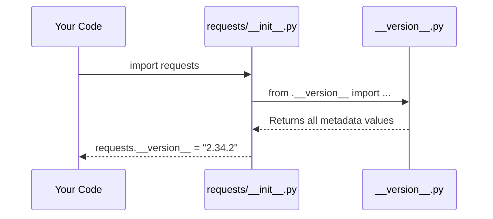
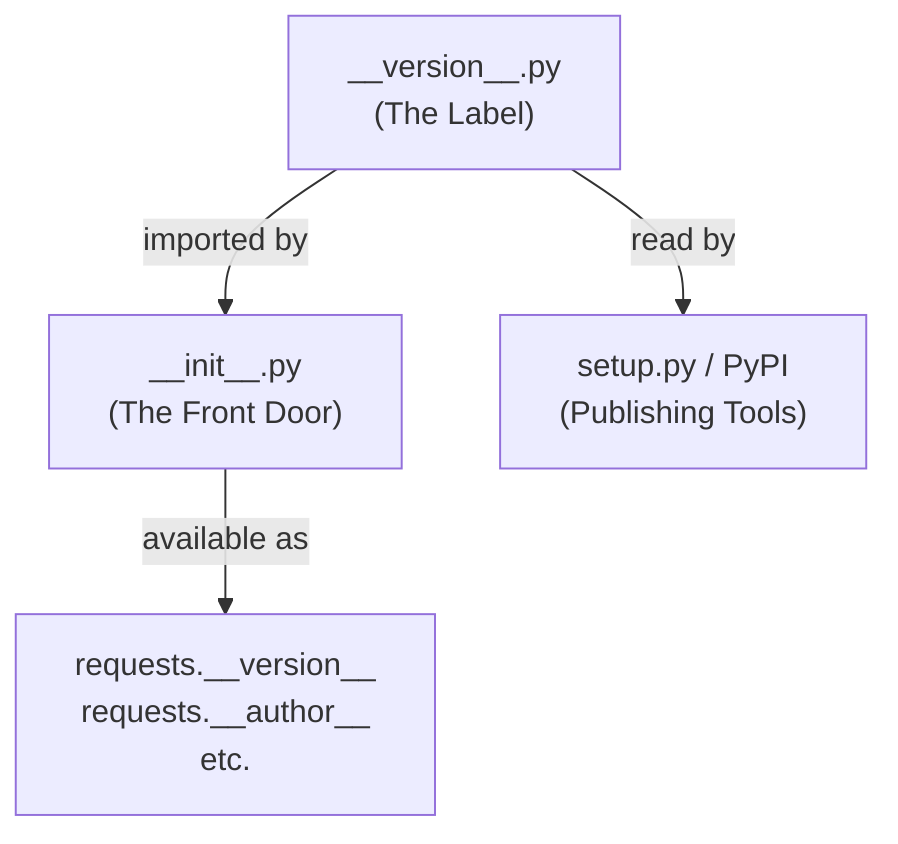

# Chapter 1: Package Versioning & Metadata

Welcome to the very first chapter of our journey into the `requests` library! We're going to start with something that might seem small, but is actually the foundation of every Python package you'll ever use: **versioning and metadata**.

---

## Why Does This Matter? 🏷️

Imagine you walk into a store and pick up a box of cereal. The label on the box tells you:
- What it is ("Corn Flakes")
- Who made it ("Kellogg's")
- What version or batch it is ("Best by: Jan 2025")

Without that label, you'd have no idea what you're holding!

Python packages work the same way. When you install `requests`, how do you know *which version* you have? How does your project know if it's compatible with other libraries? How does PyPI (the Python Package Index) know who made it?

That's exactly what **package metadata** solves.

### A Concrete Example

Let's say you're debugging a bug, and someone asks: *"What version of requests are you using?"*

Here's how you'd answer that in Python:

```python
import requests

print(requests.__version__)
```

**Output:**
```
2.34.2
```

Simple! But where does that `2.34.2` actually come from? That's what we'll explore in this chapter.

---

## Key Concepts

### 1. What is a Version Number?

Version numbers like `2.34.2` follow a pattern called **Semantic Versioning** (or "SemVer"). Think of it like this:

```
  2  .  34  .  2
  ^      ^     ^
Major  Minor  Patch
```

- **Major** (`2`): Big changes, possibly breaking old code
- **Minor** (`34`): New features, but still compatible
- **Patch** (`2`): Small bug fixes

So `2.34.2` means: "Major version 2, the 34th set of features, 2nd bug fix."

### 2. What is Metadata?

Metadata is simply *data about data*. For a package, it's information *about* the package itself — not the code that does the work, but the label that describes it.

---

## The `__version__.py` File

In `requests`, all this identity information lives in one special file: `src/requests/__version__.py`.

Let's look at it piece by piece.

### The Basic Info

```python
__title__ = "requests"
__description__ = "Python HTTP for Humans."
__url__ = "https://requests.readthedocs.io"
```

This is like the front of the product box:
- `__title__`: The name of the package
- `__description__`: A one-line summary of what it does
- `__url__`: Where to find the documentation

### The Version

```python
__version__ = "2.34.2"
__build__ = 0x023402
```

- `__version__`: The human-readable version string (what you'll use most often)
- `__build__`: A hexadecimal (machine-friendly) version of the same number

> 💡 `0x023402` is just `2.34.2` encoded in hex format. It's used internally for quick numeric comparisons.

### The Author & License

```python
__author__ = "Kenneth Reitz"
__author_email__ = "me@kennethreitz.org"
__license__ = "Apache-2.0"
__copyright__ = "Copyright Kenneth Reitz"
```

This is like the "Manufactured by" section on the box:
- Who created it
- How you're legally allowed to use it (the license)

### The Fun Bit 🎂

```python
__cake__ = "\u2728 \U0001f370 \u2728"
```

This decodes to: `✨ 🎂 ✨`

Just a little Easter egg from the author. Every package has a personality!

---

## How It All Connects

When you run `import requests`, Python loads the package. The main `requests` package imports these values from `__version__.py` and makes them available to you.

Here's a simple diagram of what happens:



So when you type `requests.__version__`, you're reading a value that was loaded from `__version__.py` at import time.

---

## Trying It Yourself

Let's explore the metadata interactively. Open a Python shell and try these:

```python
import requests

print(requests.__version__)   # "2.34.2"
print(requests.__author__)    # "Kenneth Reitz"
print(requests.__license__)   # "Apache-2.0"
```

**Output:**
```
2.34.2
Kenneth Reitz
Apache-2.0
```

You can also check the description:

```python
print(requests.__description__)
```

**Output:**
```
Python HTTP for Humans.
```

---

## Under the Hood: How Does `requests` Expose This?

Let's peek at how the metadata flows from `__version__.py` into the main package.

In `src/requests/__init__.py`, you'll find something like this:

```python
from .__version__ import (
    __version__,
    __author__,
    __license__,
    # ... and so on
)
```

This is a simple Python import. The `__init__.py` file is the "front door" of the `requests` package. When you do `import requests`, Python runs `__init__.py`, which in turn imports everything from `__version__.py`.

Think of it like this:

```
__version__.py  ──imports──▶  __init__.py  ──exposes──▶  You
  (the label)                 (the front door)           (the user)
```

---

## Why Keep It in a Separate File?

You might wonder: *"Why not just put `__version__ = '2.34.2'` directly in `__init__.py`?"*

Great question! Keeping it separate has real benefits:

| Reason | Explanation |
|--------|-------------|
| **Single source of truth** | Only one place to update the version |
| **Easy for tools to read** | Build tools can read `__version__.py` without importing the whole package |
| **Clean organization** | Separates identity from functionality |

---

## The `setup.py` Connection

There's one more piece: `setup.py`. This file tells Python's packaging tools how to install `requests`.

```python
import sys

if sys.version_info < (3, 10):
    sys.stderr.write("Requests requires Python 3.10 or later.\n")
    sys.exit(1)

from setuptools import setup
setup()
```

Notice the version check at the top! Before even trying to install, it makes sure you're running Python 3.10 or newer. If not, it prints a friendly error and stops.

The actual package details (like the version number) are read from a `pyproject.toml` or `setup.cfg` file, which references the metadata we've been exploring.

---

## A Quick Summary

Here's everything we covered, in one picture:



---

## Conclusion

In this chapter, you learned:

- 📦 **What package metadata is** — the "label" on a Python package
- 🔢 **How version numbers work** — Major.Minor.Patch
- 📄 **Where `requests` stores its metadata** — in `__version__.py`
- 🔗 **How it flows to you** — via `__init__.py` imports
- 🛠️ **Why it matters** — for compatibility, debugging, and publishing

This might seem like a small detail, but it's the foundation that makes the entire Python ecosystem work together. Every time you check a version or install a compatible package, this system is at work!

---

In the next chapter, we'll look at something equally foundational but more security-focused: how `requests` knows *which websites to trust* when making secure connections.

➡️ Continue to [Chapter 2: CA Certificate Bundle (Trust Store)](02_ca_certificate_bundle__trust_store__.md)

---

Generated by [AI Codebase Knowledge Builder](https://github.com/The-Pocket/Tutorial-Codebase-Knowledge)