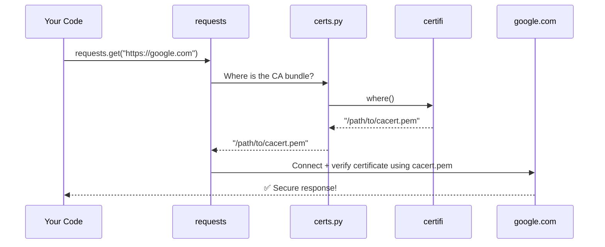
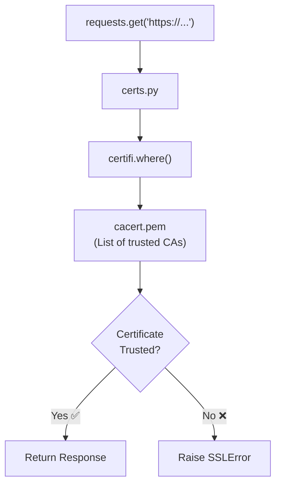

# Chapter 2: CA Certificate Bundle (Trust Store)

Welcome back! In [Chapter 1: Package Versioning & Metadata](01_package_versioning___metadata_.md), we explored how `requests` identifies itself — its name, version, and author. Now we're going to look at something equally important but more security-focused: **how `requests` knows which websites to trust**.

---

## Why Does This Matter? 🔒

Imagine you receive a letter claiming to be from your bank. How do you know it's *really* from your bank and not a scammer? You'd look for official signs — a real stamp, a known address, a signature you recognize.

When your computer visits a website using `https://`, the same problem exists. The website sends a **certificate** saying "I am really google.com." But how does your computer know that certificate is genuine?

That's where the **CA Certificate Bundle** comes in.

---

## The Central Use Case

Let's say you write this simple code:

```python
import requests

response = requests.get("https://www.google.com")
print(response.status_code)
```

**Output:**
```
200
```

It works! But behind the scenes, `requests` just verified that `google.com` is who it claims to be. How? That's exactly what this chapter explains.

---

## Key Concepts

### 1. What is HTTPS?

When a URL starts with `https://`, the connection is **encrypted and verified**. The "S" stands for Secure.

Think of it like sending a letter in a locked box, where only the recipient has the key — *and* you've verified the recipient is who they say they are.

### 2. What is a Certificate?

When you connect to `https://google.com`, Google's server sends your computer a **digital certificate**. This certificate says:

> "I am google.com, and I was verified by [trusted authority]."

It's like a passport — it proves identity.

### 3. What is a Certificate Authority (CA)?

A **Certificate Authority** is a trusted organization that issues and signs certificates. Examples include DigiCert, Let's Encrypt, and GlobalSign.

Think of CAs like governments that issue passports. When you see a passport, you trust it because you trust the government that issued it.

### 4. What is a CA Bundle?

Your computer can't trust every CA in the world automatically. Instead, it keeps a **list of trusted CAs** — this is the **CA Bundle** (also called a Trust Store).

```
CA Bundle = List of trusted "passport issuers"
```

When `requests` sees a certificate, it checks: *"Was this signed by someone on my trusted list?"*

---

## The Analogy in Full

```
Website Certificate  =  Passport
Certificate Authority  =  Government that issued the passport
CA Bundle  =  Your list of governments you trust
```

If a website's certificate was signed by a CA in the bundle → ✅ Trusted  
If not → ❌ Connection refused (SSL error)

---

## How `requests` Handles This

Here's the beautiful part: **you don't have to do anything**. `requests` handles it automatically!

The secret lives in a tiny file called `certs.py`:

```python
from certifi import where
```

That's almost the entire file! It imports one function — `where()` — from a package called `certifi`.

### What is `certifi`?

`certifi` is a Python package that ships with an up-to-date list of trusted CAs, maintained by Mozilla (the makers of Firefox). It's like having a constantly updated passport verification guide.

### What does `where()` do?

The `where()` function simply returns the **file path** to the CA bundle on your computer.

```python
import certifi

print(certifi.where())
```

**Output (example):**
```
/usr/local/lib/python3.11/site-packages/certifi/cacert.pem
```

This is a `.pem` file — a text file containing hundreds of trusted CA certificates.

---

## Seeing It in Action

You can run `certs.py` directly to see where your CA bundle lives:

```python
# From the requests library itself
from requests.certs import where

print(where())
```

**Output (example):**
```
/usr/local/lib/python3.11/site-packages/certifi/cacert.pem
```

This path points to the file that `requests` uses every time you make an HTTPS request.

---

## What Happens During an HTTPS Request?

Here's a step-by-step walkthrough of what happens when you call `requests.get("https://google.com")`:



Let's walk through each step:

1. **You** call `requests.get()`
2. **requests** asks `certs.py`: "Where's the CA bundle?"
3. **certs.py** asks `certifi`: "Where is your CA file?"
4. **certifi** returns the file path
5. **requests** uses that file to verify Google's certificate
6. If verified → you get a response! 🎉

---

## Diving Into the Code

Let's look at the full `certs.py` file — it's wonderfully simple:

```python
from certifi import where

if __name__ == "__main__":
    print(where())
```

That's it! Two meaningful lines.

- **Line 1**: Import the `where` function from `certifi`
- **Lines 3-4**: If you run this file directly, print the CA bundle path

The `requests` library then uses `where()` internally whenever it needs to verify an HTTPS connection.

### How `requests` uses it internally

When `requests` sets up an HTTPS connection, it calls `where()` to get the certificate path:

```python
# Simplified from requests internals
from .certs import where

# Use the CA bundle path for SSL verification
ssl_verify = where()  # e.g., "/path/to/cacert.pem"
```

This path is then passed to the underlying SSL library, which does the actual certificate checking.

---

## What If Verification Fails?

If a website's certificate can't be verified, `requests` raises an error:

```python
import requests

# This will raise an error if the cert is invalid
response = requests.get("https://expired.badssl.com/")
```

**Output:**
```
SSLError: certificate verify failed
```

This is `requests` *protecting you* — it's saying "I don't trust this website's certificate!"

---

## Turning Off Verification (⚠️ Not Recommended!)

You *can* disable verification, but only do this for testing:

```python
import requests

# WARNING: Only for testing! Never in production!
response = requests.get("https://example.com", verify=False)
```

This is like accepting a passport without checking if it's real. Dangerous!

---

## The Big Picture

Here's how everything fits together:



---

## Why This Design is Clever

The `certs.py` file is intentionally tiny. Here's why this is smart:

| Design Choice | Benefit |
|---------------|---------|
| Delegates to `certifi` | Mozilla keeps the CA list up-to-date |
| Single `where()` function | Easy to swap out for custom bundles |
| Automatic by default | You don't need to think about it |

> 💡 **For advanced users**: If you're packaging `requests` for a Linux distribution, you can replace `where()` to point to your system's CA bundle instead of `certifi`'s. That's why the comment in `certs.py` mentions this possibility!

---

## Quick Recap

Let's summarize with our passport analogy one more time:

```
You visiting https://google.com
    = You checking someone's passport

Google's SSL Certificate
    = The passport

Certificate Authority (CA)
    = The government that issued the passport

CA Bundle (cacert.pem)
    = Your list of governments you trust

certifi
    = The organization that keeps your trusted list updated

certs.py
    = The helper that tells requests where to find that list
```

---

## Conclusion

In this chapter, you learned:

- 🔒 **Why HTTPS needs verification** — to prove websites are who they claim to be
- 🏛️ **What Certificate Authorities are** — trusted "passport issuers" for the internet
- 📋 **What a CA Bundle is** — a list of trusted CAs stored in a `.pem` file
- 📦 **How `requests` uses `certifi`** — via the tiny but powerful `certs.py` module
- 🛡️ **Why this protects you** — invalid certificates raise errors automatically

The best part? You get all this security for free, without writing a single line of SSL code yourself. `requests` truly lives up to its motto: *"HTTP for Humans."*

---

In the next chapter, we'll explore how `requests` handles compatibility with its bundled (vendored) dependencies — a clever system that keeps everything working smoothly across different environments.

➡️ Continue to [Chapter 3: Vendored Package Compatibility Layer](03_vendored_package_compatibility_layer_.md)

---

Generated by [AI Codebase Knowledge Builder](https://github.com/The-Pocket/Tutorial-Codebase-Knowledge)