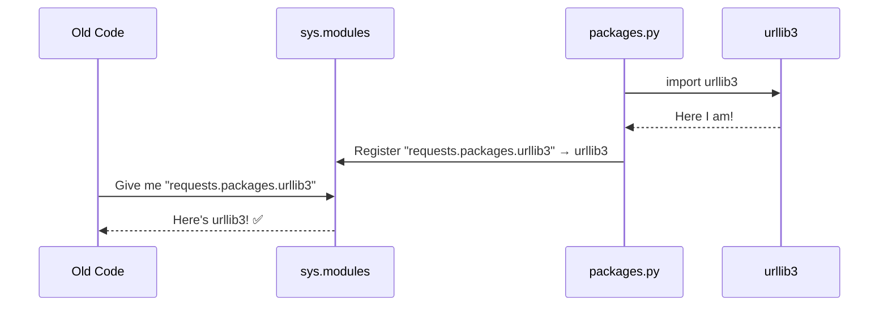
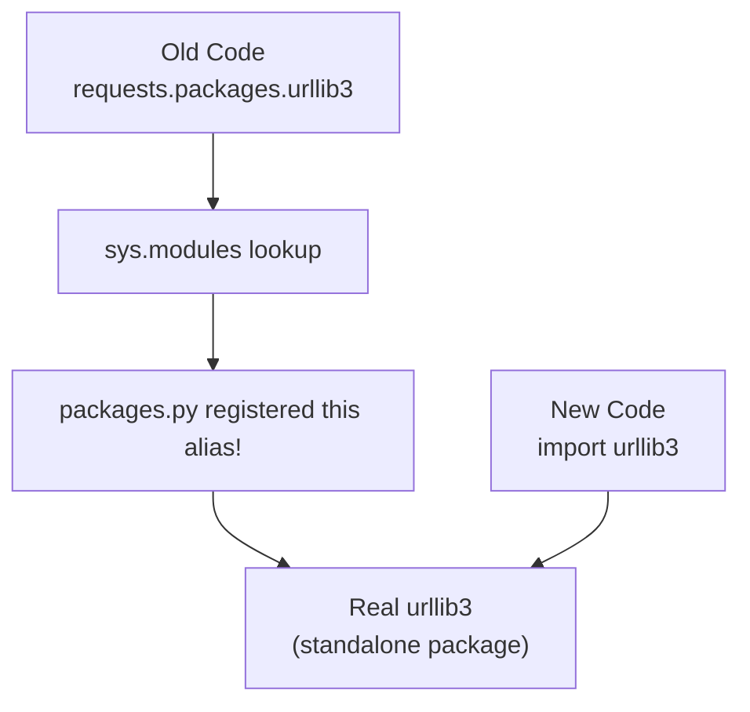

# Chapter 3: Vendored Package Compatibility Layer

Welcome back! In [Chapter 2: CA Certificate Bundle (Trust Store)](02_ca_certificate_bundle__trust_store__.md), we saw how `requests` uses `certifi` to verify that websites are who they claim to be. Now we're going to explore a clever behind-the-scenes mechanism that keeps old code working even as `requests` evolves: the **Vendored Package Compatibility Layer**.

---

## Why Does This Matter? 🔌

Imagine you've been using a TV remote for years. One day, the TV manufacturer releases a new remote with a slightly different design — but they also include an **adapter** so your old remote still works perfectly.

That's exactly what `packages.py` does for `requests`.

---

## The Central Use Case

Let's say you find some old code (or a library you depend on) that does this:

```python
import requests

# Old-style access to urllib3 through requests
http = requests.packages.urllib3.PoolManager()
```

This code was written years ago, when `urllib3` was *bundled inside* `requests`. Today, `urllib3` is a separate, standalone package. So... does this old code still work?

**Yes! And `packages.py` is the reason why.** Let's understand how.

---

## Key Concepts

### 1. What Does "Vendored" Mean?

**Vendoring** means copying a third-party library *directly into your project* instead of listing it as a separate dependency.

Think of it like this:

```
Normal approach:   Your app → downloads urllib3 separately
Vendored approach: Your app → urllib3 is already inside your app's folder
```

In the early days of `requests`, libraries like `urllib3` and `idna` were bundled (vendored) inside the `requests` package itself. You could access them as `requests.packages.urllib3`.

### 2. Why Did This Change?

Bundling libraries inside `requests` caused problems:
- If `urllib3` released a security fix, you'd have to wait for `requests` to update too
- Having two copies of `urllib3` on the same system could cause conflicts
- It made `requests` bigger and harder to maintain

So the `requests` team made `urllib3` and `idna` **standalone dependencies** — separate packages that get installed alongside `requests`.

### 3. The Backwards Compatibility Problem

Here's the tricky part. Lots of existing code was written like this:

```python
# This old code expects urllib3 to live inside requests
requests.packages.urllib3.disable_warnings()
```

If `requests` simply removed the bundled packages, all that old code would **break instantly**. That's a terrible experience for users!

### 4. The Compatibility Bridge

Instead of breaking old code, `requests` created a **compatibility bridge** in `packages.py`. It's like a phone adapter — it makes the old plug still fit the new socket.

```
Old code says:  requests.packages.urllib3
Bridge says:    "Oh, you mean the standalone urllib3? Let me redirect you!"
New reality:    urllib3 (installed separately)
```

---

## How It Works: A Simple Analogy

Imagine a library (the book kind 📚) that used to keep copies of certain books *in its own building*. Later, those books moved to a separate building across the street.

The library puts up a **sign** that says:

> "Looking for Book X? It's now at Building B, Room 3. We'll take you there automatically!"

`packages.py` is that sign. It tells Python: "When someone asks for `requests.packages.urllib3`, send them to the real `urllib3` instead."

---

## Seeing It in Action

Let's verify that the compatibility layer actually works:

```python
import requests

# Old-style access (should still work!)
print(requests.packages.urllib3)
```

**Output (something like):**
```
<module 'urllib3' from '/path/to/urllib3/__init__.py'>
```

It works! Even though `urllib3` is no longer bundled inside `requests`, the old path still resolves correctly.

You can also verify they point to the *same* object:

```python
import urllib3
import requests

# Are these the same module?
print(requests.packages.urllib3 is urllib3)
```

**Output:**
```
True
```

They're identical! The compatibility layer doesn't create a copy — it just creates an **alias** that points to the real thing.

---

## Under the Hood: What Actually Happens?

Let's walk through what `packages.py` does step by step, without looking at code first.

### Step-by-Step Walkthrough

1. **`requests` is imported** — Python runs `packages.py` as part of loading `requests`
2. **`packages.py` imports `urllib3`** — the real, standalone `urllib3` package
3. **It registers aliases in `sys.modules`** — Python's module registry
4. **Old code asks for `requests.packages.urllib3`** — Python checks `sys.modules`
5. **The alias is found** — Python returns the real `urllib3` module

Here's a diagram of that flow:



The key insight: `sys.modules` is Python's **module registry** — a dictionary that maps module names to module objects. By adding entries to it, `packages.py` creates shortcuts!

---

## Diving Into the Code

Now let's look at the actual `packages.py` file. It's short but clever!

### Part 1: Importing the packages

```python
import sys
from .compat import chardet

for package in ("urllib3", "idna"):
    locals()[package] = __import__(package)
```

This loops over `urllib3` and `idna`, importing each one. `locals()[package] = ...` makes them available as local variables (like `urllib3 = __import__("urllib3")`).

### Part 2: Registering the aliases

```python
    for mod in list(sys.modules):
        if mod == package or mod.startswith(f"{package}."):
            sys.modules[f"requests.packages.{mod}"] = sys.modules[mod]
```

This is the magic! For every module that's already loaded (like `urllib3`, `urllib3.util`, `urllib3.poolmanager`, etc.), it creates a matching entry under `requests.packages.*`.

So `sys.modules` ends up looking like this:

```
"urllib3"                          → <urllib3 module>
"urllib3.util"                     → <urllib3.util module>
"requests.packages.urllib3"        → <urllib3 module>      ← alias!
"requests.packages.urllib3.util"   → <urllib3.util module> ← alias!
```

### Part 3: Handling chardet

```python
if chardet is not None:
    target = chardet.__name__
    for mod in list(sys.modules):
        if mod == target or mod.startswith(f"{target}."):
            imported_mod = sys.modules[mod]
            sys.modules[f"requests.packages.{mod}"] = imported_mod
```

`chardet` is an optional character-encoding detection library. If it's installed, the same aliasing trick is applied. The extra step here also normalizes the name to `"chardet"` regardless of which variant is installed.

---

## The Big Picture

Here's how everything fits together visually:



Both old code and new code end up at the **same real `urllib3`**. No duplication, no confusion!

---

## Why This Design is Clever

| Problem | Solution |
|---------|----------|
| Old code breaks when packages are un-bundled | Aliases in `sys.modules` keep old paths working |
| Two copies of urllib3 could conflict | Aliases point to the *same* object, no copies |
| Maintenance burden of bundling | Libraries are now standalone and update independently |

The comment in the source code says it best:

```python
# This code exists for backwards compatibility reasons.
# I don't like it either. Just look the other way. :)
```

Even the `requests` developers admit it's a bit of a hack — but it's a *necessary* one that protects millions of users from broken code!

---

## A Quick Experiment

You can see the aliases in `sys.modules` yourself:

```python
import requests
import sys

# Find all requests.packages.* entries
aliases = [k for k in sys.modules if "requests.packages" in k]
print(aliases[:5])  # Show first 5
```

**Output (example):**
```
['requests.packages.urllib3',
 'requests.packages.urllib3.util',
 'requests.packages.urllib3.response',
 'requests.packages.idna',
 'requests.packages.idna.core']
```

There they are — all the aliases that `packages.py` created!

---

## Conclusion

In this chapter, you learned:

- 📦 **What "vendoring" means** — bundling third-party libraries inside your own package
- 🔄 **Why `requests` stopped vendoring** — to allow independent updates and avoid conflicts
- 🌉 **What the compatibility bridge does** — keeps old `requests.packages.*` paths working
- 🗂️ **How `sys.modules` aliasing works** — registering shortcuts in Python's module registry
- 😅 **Why it's a necessary hack** — protecting millions of users from broken code

This is a great example of a real-world engineering trade-off: the code isn't pretty, but it solves a genuine problem elegantly. Sometimes the best code is the code that quietly keeps everything working without anyone noticing!

---

You've now completed the first three chapters of this tutorial. You've explored how `requests` identifies itself with [Package Versioning & Metadata](01_package_versioning___metadata_.md), how it keeps you secure with the [CA Certificate Bundle (Trust Store)](02_ca_certificate_bundle__trust_store__.md), and how it maintains backwards compatibility with the Vendored Package Compatibility Layer. These three systems work quietly in the background every time you use `requests` — and now you know exactly how they work! 🎉

---

Generated by [AI Codebase Knowledge Builder](https://github.com/The-Pocket/Tutorial-Codebase-Knowledge)