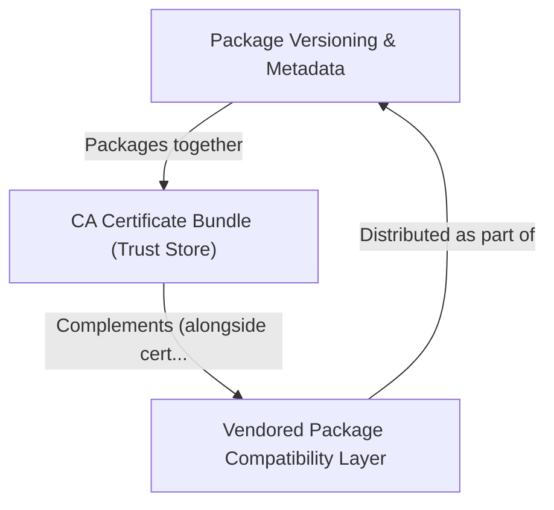

# Tutorial: requests

The `requests` library is a popular **Python HTTP client** that makes it easy to send web requests
(like fetching a webpage or calling an API) in a *human-friendly* way. It handles complex tasks
like **SSL/HTTPS verification**, authentication, and session management automatically.
The project is carefully versioned and packaged, ensures *secure connections* by trusting
verified Certificate Authorities, and maintains **backwards compatibility** with older code
that referenced its previously bundled dependencies.

**Source Repository:** [https://github.com/psf/requests](https://github.com/psf/requests)

## Chapters

1. [Package Versioning & Metadata
](01_package_versioning___metadata_.md)
2. [CA Certificate Bundle (Trust Store)
](02_ca_certificate_bundle__trust_store__.md)
3. [Vendored Package Compatibility Layer
](03_vendored_package_compatibility_layer_.md)

---

Generated by [AI Codebase Knowledge Builder](https://github.com/The-Pocket/Tutorial-Codebase-Knowledge)