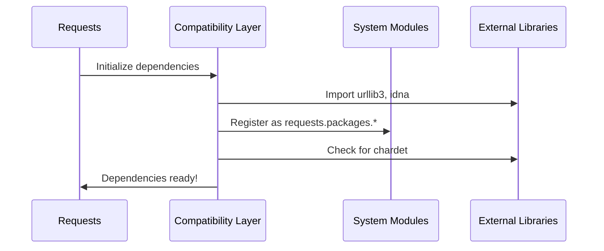

# Chapter 1: Dependency Compatibility Layer

## What Problem Does This Solve?

Imagine you're building a house and you need to connect different electrical appliances - a lamp from 2015, a TV from 2020, and a computer from 2023. Each device might have slightly different plug shapes or power requirements, but you want them all to work with your electrical system without worrying about the differences.

The `requests` library faces a similar challenge! It relies on several external libraries like `urllib3` (for HTTP connections), `idna` (for international domain names), and `chardet` (for character encoding detection). Different versions of these libraries might have slightly different interfaces or behaviors. The Dependency Compatibility Layer acts like a universal adapter, ensuring that `requests` works smoothly regardless of which versions of these dependencies you have installed.

## A Real-World Example

Let's say you're writing a simple script to fetch data from a website:

```python
import requests
response = requests.get('https://example.com')
print(response.text)
```

Behind the scenes, this simple call relies on multiple libraries working together. Without the compatibility layer, you might run into errors like "module not found" or "incompatible version" depending on what's installed on your system.

## Key Concepts

### 1. External Dependencies

The `requests` library doesn't do everything by itself. It's like a team leader that coordinates with specialists:

- **urllib3**: Handles the actual HTTP connections
- **idna**: Manages international domain names (like websites with non-English characters)
- **chardet**: Detects what character encoding a webpage uses

### 2. Version Compatibility

Different versions of these libraries might work slightly differently. The compatibility layer ensures that whether you have urllib3 version 1.25 or 1.26, `requests` can still use it correctly.

### 3. Import Management

The layer creates a consistent way to access these libraries, so the rest of the `requests` code doesn't need to worry about where they come from or how they're installed.

## How It Works: A Step-by-Step Walkthrough

Here's what happens when `requests` starts up and sets up its compatibility layer:



Let's break this down:

1. **Import Detection**: The system checks what external libraries are available
2. **Module Registration**: It creates aliases so these libraries can be accessed through `requests.packages`
3. **Compatibility Setup**: It ensures all libraries can talk to each other
4. **Ready to Use**: Now `requests` can use these libraries consistently

## The Implementation

Let's look at how this magic happens in the code. The main work is done in the `packages.py` file:

### Step 1: Import Required Libraries

```python
import sys
from .compat import chardet
```

This imports the system module manager and checks for the `chardet` library through a compatibility module.

### Step 2: Handle Core Dependencies

```python
for package in ("urllib3", "idna"):
    locals()[package] = __import__(package)
```

This code loops through the essential libraries (`urllib3` and `idna`) and imports each one. It's like checking that you have the right tools before starting a job.

### Step 3: Create Package Aliases

```python
for mod in list(sys.modules):
    if mod == package or mod.startswith(f"{package}."):
        sys.modules[f"requests.packages.{mod}"] = sys.modules[mod]
```

This creates aliases so that code can access `requests.packages.urllib3` instead of just `urllib3`. It's like creating shortcuts on your desktop that all point to the same programs.

### Step 4: Handle Optional Dependencies

```python
if chardet is not None:
    # Similar aliasing process for chardet
    target = chardet.__name__
    # ... create aliases for chardet modules
```

Since `chardet` might not always be available, this code carefully checks if it exists before creating aliases for it.

## Why This Design Matters

Think of this layer as a diplomatic translator at the United Nations. Just as the translator ensures that delegates speaking different languages can understand each other, the compatibility layer ensures that different library versions can work together harmoniously.

The benefits include:

- **Backwards Compatibility**: Older code continues to work even when dependencies are updated
- **Flexibility**: Users can have different versions of dependencies without breaking `requests`
- **Consistent Interface**: The rest of the `requests` code can rely on a stable way to access these libraries

## What You've Learned

In this chapter, you discovered how the `requests` library creates a compatibility bridge for its external dependencies. This layer acts like a universal adapter, ensuring that libraries like `urllib3`, `idna`, and `chardet` work together smoothly regardless of their versions.

The key takeaway is that this abstraction handles complexity behind the scenes, so you can focus on making HTTP requests without worrying about dependency management.

Next, we'll explore how `requests` keeps your connections secure with [Security Certificate Management](02_security_certificate_management_.md), building on the stable foundation that this compatibility layer provides.

---

Generated by [AI Codebase Knowledge Builder](https://github.com/The-Pocket/Tutorial-Codebase-Knowledge)