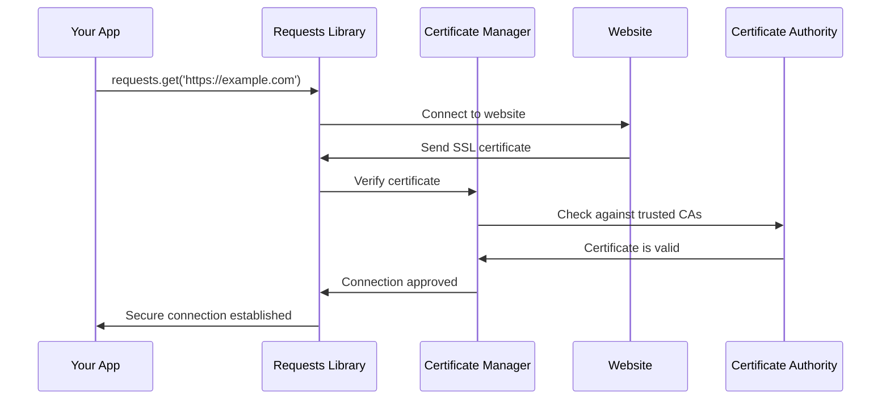

# Chapter 2: Security Certificate Management

Building on the solid foundation of the [Dependency Compatibility Layer](01_dependency_compatibility_layer_.md) we explored earlier, let's dive into one of the most crucial aspects of web security: how `requests` keeps your connections safe and secure.

## What Problem Does This Solve?

Imagine you're planning to meet a friend at a busy coffee shop, but you've never seen them before. How do you know the person claiming to be your friend is actually who they say they are? You might ask them to show you their driver's license or another form of trusted identification.

The internet has the same problem! When your program tries to connect to a website like `https://github.com`, how does it know it's really talking to GitHub and not some malicious imposter trying to steal your data? This is where **SSL/TLS certificates** come to the rescue - they're like digital driver's licenses for websites.

Let's look at a simple example:

```python
import requests

# This looks simple, but there's a lot of security happening behind the scenes!
response = requests.get('https://github.com')
print(f"Successfully connected to GitHub: {response.status_code}")
```

When you run this code, `requests` automatically verifies that you're really talking to GitHub by checking their digital certificate against a trusted list. If something seems fishy, it will stop the connection and protect you from potential security threats.

## Key Concepts

### 1. What Are SSL/TLS Certificates?

Think of certificates like official government-issued IDs for websites. Just as a driver's license contains:
- Your name
- Your photo
- An official government seal
- An expiration date

A website's certificate contains:
- The website's domain name
- The website's public key (for encryption)
- A digital signature from a trusted Certificate Authority
- An expiration date

### 2. Certificate Authorities (CAs)

Certificate Authorities are like the DMV for the internet - they're trusted organizations that issue and verify digital certificates. Some well-known CAs include:
- Let's Encrypt
- DigiCert
- GlobalSign

### 3. Certificate Bundle

Instead of storing each CA's certificate separately, they're all bundled together in one big file - like a phone book of trusted certificate authorities. The `requests` library uses a package called `certifi` that maintains this trusted certificate bundle.

## How Certificate Verification Works

Here's what happens when you make a secure HTTPS request:



Let's break this down step by step:

1. **Connection Request**: Your app asks to connect to a website
2. **Certificate Exchange**: The website sends its digital certificate
3. **Verification**: The certificate manager checks if it's signed by a trusted CA
4. **Validation**: The certificate is confirmed as genuine and not expired
5. **Secure Connection**: Your data can now be safely transmitted

## Using Certificate Management in Practice

### Basic Secure Request

```python
import requests

# This automatically uses certificate verification
response = requests.get('https://httpbin.org/get')
print("Connection successful and secure!")
```

This simple request automatically verifies the website's certificate using the built-in certificate bundle.

### Checking Certificate Details

```python
import requests

try:
    response = requests.get('https://expired.badssl.com')
except requests.exceptions.SSLError as e:
    print(f"Certificate verification failed: {e}")
```

If you run this code, you'll see that `requests` protects you by refusing to connect to a site with an invalid certificate.

### Custom Certificate Bundle

```python
import requests

# Use a custom certificate bundle (advanced usage)
response = requests.get(
    'https://httpbin.org/get',
    verify='/path/to/custom/certificate.pem'
)
```

This shows how you can specify your own certificate bundle if needed (though the default is usually perfect).

## Under the Hood: How It's Implemented

The certificate management in `requests` is elegantly simple. Let's look at how it works internally:

### The Certificate Module

The magic happens in a tiny but important file called `certs.py`. Here's the complete implementation:

```python
from certifi import where

if __name__ == "__main__":
    print(where())
```

Wait, that's it? Yes! This beautifully demonstrates the power of good abstraction. Let's understand what's happening:

### Step 1: Delegating to Certifi

```python
from certifi import where
```

This line imports the `where` function from the `certifi` package. The `certifi` package is maintained by the same team that works on `requests`, and it contains an up-to-date bundle of trusted root certificates.

### Step 2: Finding the Certificate Bundle

The `where()` function returns the file path to the certificate bundle on your system. You can try this yourself:

```python
import requests.certs

print(requests.certs.where())
# Output: /path/to/your/python/site-packages/certifi/cacert.pem
```

This shows exactly where the trusted certificates are stored on your computer.

### Step 3: Integration with Requests

When you make an HTTPS request, `requests` automatically uses this certificate bundle:

```python
import requests

# Behind the scenes, this is roughly equivalent to:
response = requests.get(
    'https://httpbin.org/get',
    verify=requests.certs.where()  # Uses the certificate bundle
)
```

The `verify` parameter tells `requests` which certificate bundle to use for verification.

## Why This Design is Brilliant

This approach follows several important design principles:

### 1. Separation of Concerns

Instead of managing certificates directly, `requests` delegates this responsibility to the specialized `certifi` package. It's like hiring a security expert instead of trying to become one yourself.

### 2. Automatic Updates

The `certifi` package is regularly updated with the latest trusted certificates. When you update your packages, you automatically get the latest security updates.

### 3. Simplicity

The entire certificate management system is just a few lines of code, but it provides enterprise-grade security for your applications.

### 4. Flexibility

While the defaults work great for 99% of use cases, you can still provide your own certificate bundle when needed for special environments.

## Real-World Security Benefits

This certificate management system protects you from several types of attacks:

### Man-in-the-Middle Attacks

```python
# Without certificate verification, this could be dangerous:
response = requests.get('https://bank.com', verify=False)  # DON'T DO THIS!

# With verification (the default), you're protected:
response = requests.get('https://bank.com')  # Much safer!
```

The first example disables certificate verification, which could allow attackers to intercept your data. The second example (which is the default behavior) keeps you safe.

### Expired Certificates

```python
try:
    response = requests.get('https://expired.badssl.com')
except requests.exceptions.SSLError:
    print("Wisely refused to connect to site with expired certificate")
```

The certificate manager automatically checks expiration dates and refuses connections to sites with outdated certificates.

## What You've Learned

In this chapter, you discovered how `requests` keeps your connections secure through its certificate management system. Like a vigilant security guard, it automatically verifies that you're connecting to legitimate websites by checking their digital certificates against a trusted authority list.

The key insights include:

- **Automatic Protection**: Certificate verification happens automatically on every HTTPS request
- **Trusted Sources**: The `certifi` package provides a regularly updated list of trusted certificate authorities  
- **Simple Implementation**: Despite providing enterprise-grade security, the implementation is elegantly simple
- **Flexible Options**: While defaults work great, you can customize certificate handling when needed

This security foundation, combined with the [Dependency Compatibility Layer](01_dependency_compatibility_layer_.md) we learned about earlier, creates a robust and reliable foundation for web requests.

Next, we'll explore how all these components come together in the [Project Configuration & Build System](03_project_configuration___build_system_.md), which manages how the entire `requests` project is organized and distributed.

---

Generated by [AI Codebase Knowledge Builder](https://github.com/The-Pocket/Tutorial-Codebase-Knowledge)