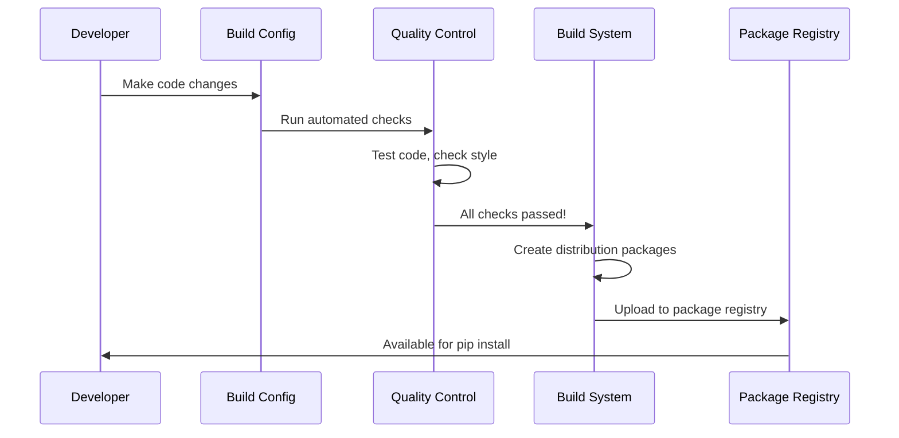

# Chapter 3: Project Configuration & Build System

Building on the robust foundation we've established with the [Dependency Compatibility Layer](01_dependency_compatibility_layer_.md) and [Security Certificate Management](02_security_certificate_management_.md), let's explore the behind-the-scenes system that makes it all possible: how the `requests` project is configured, built, and delivered to millions of developers worldwide.

## What Problem Does This Solve?

Imagine you're running a bakery that ships delicious cookies all over the world. You need more than just a great recipe - you need a complete system that handles:

- **Quality Control**: Making sure every batch meets your high standards
- **Packaging Instructions**: How to wrap cookies so they arrive fresh
- **Shipping Labels**: Where to send each order and what's inside
- **Recipe Management**: Keeping track of ingredients and versions
- **Kitchen Standards**: Rules for cleanliness and consistency

The `requests` library faces a remarkably similar challenge! It's not enough to just write great code - the project needs a complete system to ensure that when you type `pip install requests`, you get a high-quality, properly tested package that works reliably on your system.

Let's look at what happens when you install requests:

```python
# When you run: pip install requests
# Behind the scenes, a whole system springs into action:
# 1. Finds the right version for your Python
# 2. Downloads a thoroughly tested package  
# 3. Installs it with all the right dependencies
# 4. Makes it ready to import and use

import requests
response = requests.get('https://httpbin.org/get')
print("It just works! ✨")
```

This seemingly simple installation is the result of a sophisticated build and configuration system working perfectly behind the scenes.

## Key Concepts

### 1. Project Metadata

Just like a product label tells you what's in a package, project metadata tells tools like `pip` essential information about the `requests` library:

- **Name and Version**: "This is requests version 2.34.2"
- **Author Information**: Who created and maintains it
- **Dependencies**: What other packages it needs to work
- **Compatibility**: Which Python versions it supports

### 2. Build Configuration

This defines how to transform the source code into a distributable package - like instructions for turning flour, eggs, and sugar into packaged cookies ready for shipping.

### 3. Quality Control Rules

These are automated checks that ensure every release meets high standards:

- **Code Style**: Making sure the code follows consistent formatting
- **Testing Requirements**: Every feature must have passing tests
- **Documentation**: Changes must be properly documented

### 4. Development Environment Setup

Rules and scripts that help developers contribute to the project consistently, like having standardized kitchen equipment in our bakery analogy.

## How The Build System Works

Here's what happens when the `requests` team prepares a new release:



Let's break this down step by step:

1. **Code Changes**: A developer makes improvements to the library
2. **Automated Checks**: The system runs tests and style checks automatically
3. **Quality Validation**: Everything must pass strict quality requirements
4. **Package Building**: The code is transformed into installation packages
5. **Distribution**: The packages are uploaded where `pip` can find them
6. **Ready for Use**: You can now install and use the updated version

## The Configuration Files

The build system is controlled by several key configuration files. Let's explore each one:

### Project Metadata: `__version__.py`

This file contains the essential information about the project:

```python
__title__ = "requests"
__description__ = "Python HTTP for Humans."
__version__ = "2.34.2"
__author__ = "Kenneth Reitz"
```

Think of this as the project's ID card. Every time you import requests, this information is available:

```python
import requests
print(requests.__version__)  # Shows: 2.34.2
print(requests.__title__)    # Shows: requests
```

### Build Setup: `setup.py`

This file tells Python how to install the package:

```python
import sys

if sys.version_info < (3, 10):
    sys.stderr.write("Requests requires Python 3.10 or later.\n")
    sys.exit(1)

from setuptools import setup
setup()
```

This simple script does two important things:
1. **Version Check**: Ensures you have a compatible Python version
2. **Setup Delegation**: Hands off the real work to more detailed configuration files

### Quality Control: `.pre-commit-config.yaml`

This file defines automated quality checks that run before code changes:

```yaml
repos:
- repo: https://github.com/pre-commit/pre-commit-hooks
  rev: v6.0.0
  hooks:
  - id: check-case-conflict
  - id: check-merge-conflict
  - id: trailing-whitespace
```

Each "hook" is like a quality inspector that checks for specific issues:
- **check-case-conflict**: Ensures file names work on all operating systems
- **check-merge-conflict**: Catches forgotten merge conflict markers
- **trailing-whitespace**: Removes invisible spaces that can cause problems

### Documentation Building: `.readthedocs.yaml`

This file configures how the project documentation is built and published:

```yaml
version: 2
build:
  os: ubuntu-22.04
  tools:
    python: "3.12"
sphinx:
  configuration: docs/conf.py
```

This ensures that the documentation you read online is always built consistently and stays up-to-date with the code.

## The Development Workflow

Let's see how developers use this system when working on `requests`:

### Step 1: Setting Up the Environment

```bash
# Install development dependencies
make init
```

The `Makefile` defines common tasks. This command sets up everything needed for development:

```makefile
init:
    python -m pip install -r requirements-dev.txt
```

### Step 2: Running Tests

```bash
# Run the test suite
make test
```

This runs all the automated tests to make sure nothing is broken:

```makefile
test:
    python -m pytest tests
```

### Step 3: Quality Checks

```bash
# Check code coverage
make coverage
```

This verifies that the tests thoroughly check all the code:

```makefile
coverage:
    python -m pytest --cov-config .coveragerc --verbose --cov-report term --cov-report xml --cov=src/requests tests
```

## Publishing and Distribution

When it's time to release a new version, the build system handles packaging and distribution:

### Creating Distribution Packages

```makefile
publish: .publishenv
    .publishenv/bin/python -m build
    .publishenv/bin/python -m twine upload --skip-existing dist/*
```

This process:
1. **Creates a Clean Environment**: Ensures no local dependencies interfere
2. **Builds Packages**: Creates both source and wheel distributions  
3. **Uploads to PyPI**: Makes the new version available for `pip install`

### The Magic of Automation

Most of this happens automatically! When developers push changes to the main repository:

```python
# Continuous Integration automatically:
# 1. Runs all tests on multiple Python versions
# 2. Checks code style and formatting
# 3. Builds documentation
# 4. Creates release packages (if it's a release)
```

The `.readthedocs.yaml` file ensures documentation is automatically updated, and the pre-commit hooks catch issues before they reach the main codebase.

## Why This System Design Matters

This build system follows several important principles that make `requests` reliable and maintainable:

### 1. Automation Over Manual Work

Instead of relying on developers to remember dozens of steps, the system automates quality checks, testing, and packaging. It's like having a robot assistant that never forgets important steps.

### 2. Fail Fast and Early

Problems are caught as early as possible in the development process:

```python
# If your Python version is too old, setup.py stops immediately
if sys.version_info < (3, 10):
    sys.stderr.write("Requests requires Python 3.10 or later.\n")
    sys.exit(1)
```

### 3. Consistent Environments

Whether you're developing on Windows, Mac, or Linux, the configuration ensures everyone has the same development experience:

```yaml
# .readthedocs.yaml ensures docs are built the same way every time
build:
  os: ubuntu-22.04
  tools:
    python: "3.12"
```

### 4. Separation of Concerns

Different aspects of the build process are handled by specialized tools:
- **Testing**: pytest handles test execution
- **Code Quality**: pre-commit hooks handle style checking  
- **Documentation**: Sphinx handles documentation building
- **Packaging**: setuptools handles distribution creation

## Real-World Benefits

This sophisticated build system provides concrete benefits for both users and developers:

### For Users (That's You!)

```python
# You get reliable, tested software every time
pip install requests  # Always works, always tested

# Consistent behavior across all installations
import requests
requests.get('https://httpbin.org/get')  # Same behavior everywhere
```

### For Contributors

```bash
# Easy to get started contributing
make init     # Sets up everything you need
make test     # Runs the full test suite
make docs     # Builds documentation locally
```

### For Maintainers

The automation handles the tedious work, so maintainers can focus on improving the library rather than managing releases and infrastructure.

## What You've Learned

In this chapter, you've discovered the sophisticated system that makes `requests` one of the most reliable Python packages available. Like a well-organized factory, the project configuration and build system ensures that every installation of `requests` is properly tested, correctly packaged, and reliably delivered.

Key insights from this chapter include:

- **Metadata Management**: Project information is centrally managed and automatically used throughout the system
- **Quality Automation**: Automated checks catch problems before they reach users
- **Build Consistency**: Standardized processes ensure reliable packaging across different environments
- **Developer Experience**: Well-designed tooling makes it easy for contributors to maintain high quality standards

This build system works seamlessly with the [Dependency Compatibility Layer](01_dependency_compatibility_layer_.md) and [Security Certificate Management](02_security_certificate_management_.md) we explored earlier, creating a complete foundation that allows `requests` to be both powerful and reliable.

The next time you run `pip install requests` and it "just works," you'll appreciate the sophisticated engineering that makes this simple command possible. This attention to infrastructure and quality is what makes `requests` truly "HTTP for Humans" - not just in its API design, but in its entire development and distribution process.

---

Generated by [AI Codebase Knowledge Builder](https://github.com/The-Pocket/Tutorial-Codebase-Knowledge)