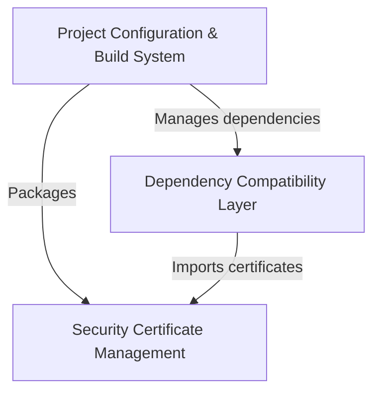

# Tutorial: requests

**Requests** is a popular Python library that makes it easy to send *HTTP requests* to websites and web services.
Think of it as a **user-friendly wrapper** that simplifies web communication - instead of dealing with complex 
networking code, developers can make web requests with just a few lines of code. The library handles all the 
complicated stuff like *SSL certificates*, *encoding*, and *connection management* behind the scenes.

**Source Repository:** [https://github.com/psf/requests](https://github.com/psf/requests)

## Chapters

1. [Dependency Compatibility Layer
](01_dependency_compatibility_layer_.md)
2. [Security Certificate Management
](02_security_certificate_management_.md)
3. [Project Configuration & Build System
](03_project_configuration___build_system_.md)

---

Generated by [AI Codebase Knowledge Builder](https://github.com/The-Pocket/Tutorial-Codebase-Knowledge)