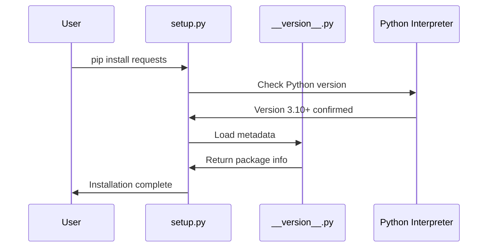

# Chapter 1: Package Metadata and Version Management

Welcome to the world of the `requests` library! Before we dive into making HTTP requests, let's start with something fundamental: how does Python know what version of `requests` you're using, and how does it ensure you have the right Python version to run it?

## The Problem: Keeping Track of Package Information

Imagine you're a librarian managing thousands of books. Each book needs a label telling you its title, author, publication date, and edition number. Without these labels, chaos would ensue - you wouldn't know which books you have or whether they're compatible with your library system.

The same thing happens with Python packages. When you install `requests`, Python needs to know:
- What is this package called?
- What version am I running?
- Who created it?
- What's the minimum Python version required?

This is where **Package Metadata and Version Management** comes in - it's like the library card catalog for your Python packages.

## Key Concepts

### 1. Package Metadata: The Identity Card

Package metadata is like an ID card for the `requests` library. It contains all the essential information about the package. Let's look at how `requests` stores this information:

```python
__title__ = "requests"
__description__ = "Python HTTP for Humans."
__version__ = "2.34.2"
__author__ = "Kenneth Reitz"
```

This code snippet shows the core identity information. Just like your driver's license has your name, address, and photo, this metadata tells Python everything it needs to know about the `requests` package.

### 2. Version Management: Compatibility Checking

Before you can use `requests`, Python needs to make sure your system can actually run it. This is like checking if you have the right type of battery before using a device:

```python
import sys

if sys.version_info < (3, 10):
    sys.stderr.write("Requests requires Python 3.10 or later.\n")
    sys.exit(1)
```

This code checks if you're running Python 3.10 or newer. If not, it politely tells you to upgrade and stops the installation.

## How to Use Package Metadata

Let's see how you can access this metadata information in your own code:

```python
import requests
print(requests.__version__)
```

**Output:** `2.34.2`

This simple command tells you exactly which version of `requests` you're using. It's like checking the edition number on a book to make sure you have the latest copy.

You can also access other metadata:

```python
print(requests.__title__)
print(requests.__author__)
```

**Output:** 
```
requests
Kenneth Reitz
```

This is incredibly useful for debugging - if you're having issues, you can quickly check which version you're running and whether you need to update.

## Under the Hood: How It All Works

Let's walk through what happens when you install and import `requests`:



### Step 1: Version Compatibility Check

When you run `pip install requests`, the first thing that happens is a compatibility check in `setup.py`:

```python
if sys.version_info < (3, 10):
    sys.stderr.write("Requests requires Python 3.10 or later.\n")
    sys.exit(1)
```

This code compares your Python version with the minimum required version (3.10). Think of it like a bouncer at a club checking if you're old enough to enter.

### Step 2: Loading Package Information

Once the version check passes, Python loads the metadata from `__version__.py`:

```python
__title__ = "requests"
__version__ = "2.34.2"
__author__ = "Kenneth Reitz"
# ... more metadata
```

Each line defines a piece of information about the package. The double underscores (`__`) are Python's way of saying "this is special metadata."

### Step 3: Making Metadata Accessible

When you import `requests`, all this metadata becomes available through the package:

```python
import requests
# Now you can access: requests.__version__, requests.__author__, etc.
```

## The Files That Make It Happen

The magic happens in two key files:

**`setup.py`** - The gatekeeper that checks if your Python version is compatible
**`src/requests/__version__.py`** - The treasure chest containing all the package metadata

These files work together like a security system and information desk at a building - one checks if you're allowed in, and the other gives you all the information you need once you're inside.

## Why This Matters for Beginners

Understanding package metadata helps you:
1. **Debug issues** - Know exactly which version you're using
2. **Ensure compatibility** - Verify you meet the requirements
3. **Stay updated** - Check if newer versions are available
4. **Learn best practices** - See how professional packages organize their information

## Conclusion

Package metadata and version management might seem like boring housekeeping, but it's the foundation that makes everything else possible. Just like a well-organized library makes it easy to find the book you need, well-managed package metadata makes it easy to work with Python libraries.

You've learned how `requests` identifies itself, manages version compatibility, and makes this information available to you as a developer. This solid foundation prepares you for the next topic: [SSL Certificate Authority Management](02_ssl_certificate_authority_management_.md), where we'll explore how `requests` keeps your HTTP connections secure.

---

Generated by [AI Codebase Knowledge Builder](https://github.com/The-Pocket/Tutorial-Codebase-Knowledge)