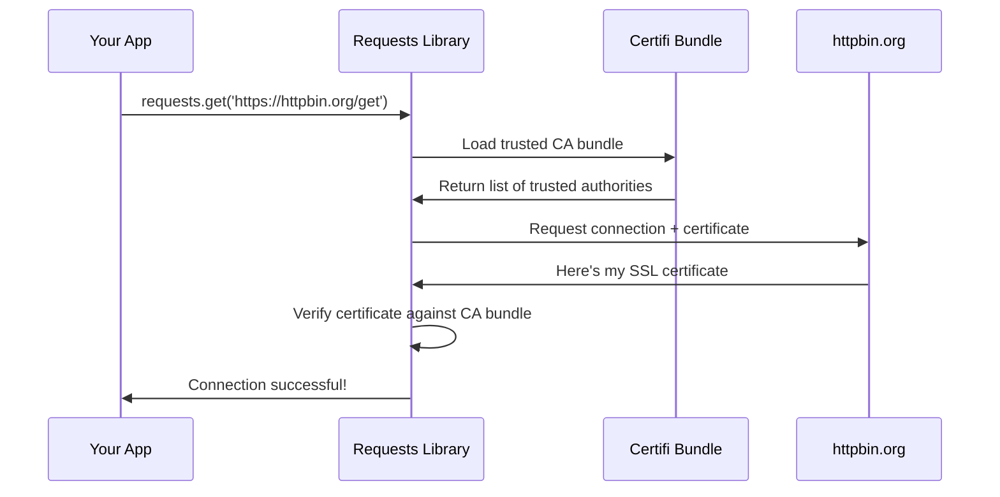

# Chapter 2: SSL Certificate Authority Management

Now that you understand how `requests` manages its package information from [Chapter 1: Package Metadata and Version Management](01_package_metadata_and_version_management_.md), let's explore another crucial foundation: how `requests` ensures your connections to websites are secure and trustworthy.

## The Problem: How Do You Know a Website Is Really Who They Say They Are?

Imagine you're meeting someone online for the first time. How do you know they're really who they claim to be? In the physical world, you might ask to see their driver's license or passport - documents issued by trusted authorities that verify their identity.

The same challenge exists when your computer connects to websites. When you visit `https://github.com`, how does your computer know it's really talking to GitHub and not some imposter trying to steal your login credentials? This is where **SSL Certificate Authority Management** comes to the rescue.

Let's say you want to download a file from GitHub using `requests`:

```python
import requests
response = requests.get('https://api.github.com/users/octocat')
print(response.status_code)  # Should print: 200
```

Behind the scenes, `requests` is performing a complex security check to make sure you're really talking to GitHub. Let's understand how this works.

## Key Concepts

### 1. SSL Certificates: Digital ID Cards for Websites

An SSL certificate is like a digital driver's license for websites. It contains:
- The website's name (like "github.com")
- A digital signature from a trusted authority
- An expiration date
- Encryption keys for secure communication

When you connect to `https://github.com`, GitHub presents its SSL certificate to prove its identity.

### 2. Certificate Authorities (CAs): The Trust Network

Certificate Authorities are like government agencies that issue driver's licenses. They're organizations that everyone agrees to trust, such as:
- DigiCert
- Let's Encrypt
- VeriSign

These authorities sign website certificates, basically saying "Yes, we've verified that this certificate really belongs to GitHub."

### 3. CA Bundle: Your Trust Address Book

A CA bundle is like your phone's contact list of trusted authorities. It's a file containing the digital signatures of hundreds of trusted Certificate Authorities. The `requests` library uses this bundle to check if a website's certificate was signed by someone trustworthy.

## How SSL Certificate Verification Works

Let's see what happens when you make a secure request:

```python
import requests

# This simple line triggers complex security checks
response = requests.get('https://httpbin.org/get')
print("Connection successful!")
```

Here's the security dance that happens behind the scenes:



### Step 1: Loading the Trust List

First, `requests` loads its list of trusted Certificate Authorities:

```python
from certifi import where
ca_bundle_path = where()
print(ca_bundle_path)
```

**Output:** `/path/to/site-packages/certifi/cacert.pem`

This file contains hundreds of trusted CA certificates that browsers and applications worldwide agree to trust.

### Step 2: Certificate Exchange

When connecting to a website, `requests` asks for the site's SSL certificate. The website responds with its digital ID card.

### Step 3: Verification

`requests` checks if the certificate was signed by any of the authorities in its trust bundle. If yes, the connection proceeds. If no, it raises an error to protect you.

## Under the Hood: How Requests Manages CA Certificates

Let's explore the surprisingly simple code that makes this security magic happen. The entire CA management system in `requests` is contained in one tiny file!

### The Complete CA Management Code

```python
from certifi import where

def get_ca_bundle_path():
    return where()
```

That's it! The `requests` library delegates all the complex CA management to the `certifi` package. Let's understand why this is brilliant.

### Why Use Certifi?

The `certifi` package is maintained by security experts and contains:
- An up-to-date bundle of trusted Certificate Authorities
- Regular updates when CAs are added or removed
- The same CA bundle that Mozilla Firefox uses

By using `certifi`, `requests` ensures you get:

```python
import certifi
import requests

# Both use the same trusted CA bundle
firefox_cas = certifi.where()
requests_cas = requests.certs.where()

print(firefox_cas == requests_cas)  # True
```

### The Actual Implementation

Here's the complete `requests/certs.py` file:

```python
from certifi import where

if __name__ == "__main__":
    print(where())
```

This elegant simplicity means:
1. **Security experts maintain the CA list** - You don't have to worry about which authorities to trust
2. **Automatic updates** - When you update `certifi`, you get the latest security updates
3. **Browser compatibility** - You use the same trust store as major browsers

## Handling Certificate Problems

Sometimes certificate verification fails. Here's how to handle it gracefully:

```python
import requests

try:
    response = requests.get('https://expired.badssl.com')
except requests.exceptions.SSLError as e:
    print(f"Certificate verification failed: {e}")
```

**Output:** `Certificate verification failed: [SSL: CERTIFICATE_VERIFY_FAILED]`

This error protects you from potentially unsafe connections. The certificate verification is working as intended!

## Customizing Certificate Verification

For advanced users, `requests` allows custom CA bundles:

```python
import requests

# Use custom CA bundle
response = requests.get(
    'https://httpbin.org/get', 
    verify='/path/to/custom/ca-bundle.pem'
)
```

**Warning for beginners:** Only disable certificate verification if you absolutely understand the security implications:

```python
# DON'T DO THIS in production!
response = requests.get('https://httpbin.org/get', verify=False)
```

## Why This Matters for Beginners

Understanding SSL Certificate Authority Management helps you:

1. **Build secure applications** - Your HTTP requests are automatically protected
2. **Debug connection issues** - Understand why some HTTPS requests might fail
3. **Make informed security decisions** - Know when and why to trust certificates
4. **Appreciate built-in security** - Recognize that `requests` protects you by default

## Real-World Example: API Integration

Let's see how this works in a practical scenario:

```python
import requests

def get_weather_data(city):
    try:
        # Certificate verification happens automatically
        url = f"https://api.openweathermap.org/data/2.5/weather"
        response = requests.get(url, params={'q': city})
        return response.json()
    except requests.exceptions.SSLError:
        print("Could not verify the weather API's certificate!")
        return None

weather = get_weather_data("London")
```

In this example, `requests` automatically verifies that you're really connecting to the OpenWeatherMap API and not an imposter trying to intercept your API calls.

## Conclusion

SSL Certificate Authority Management is like having a trusted security guard that checks every visitor's ID before letting them into your building. The `requests` library handles this complex security verification automatically, using the same trusted authorities that web browsers use.

You've learned how `requests` uses the `certifi` package to maintain an up-to-date list of trusted Certificate Authorities, how certificate verification protects your applications, and why this security happens transparently in the background.

This security foundation prepares you for our next topic: [Dependency Package Compatibility Layer](03_dependency_package_compatibility_layer_.md), where we'll explore how `requests` manages its relationships with other Python packages to ensure everything works smoothly together.

---

Generated by [AI Codebase Knowledge Builder](https://github.com/The-Pocket/Tutorial-Codebase-Knowledge)