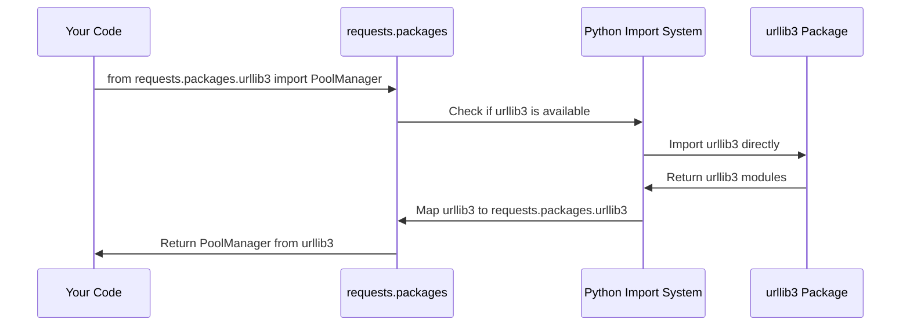

# Chapter 3: Dependency Package Compatibility Layer

After exploring how `requests` manages its security foundations in [Chapter 2: SSL Certificate Authority Management](02_ssl_certificate_authority_management_.md), let's tackle another crucial but often invisible aspect: how `requests` maintains compatibility with older code that might depend on its internal structure.

## The Problem: When Code Depends on Your Dependencies

Imagine you're a restaurant owner who has been serving customers for years. Originally, you made everything in-house, so customers would ask for "your homemade bread" or "your special sauce." But as you grew, you started buying some ingredients from specialized suppliers who make them better than you could.

The problem? Your loyal customers still come in asking for "your bread" even though you now get it from the best bakery in town. You could tell them "Sorry, go to the bakery down the street," but that would upset your customers. Instead, you keep serving the same great bread - you just get it from a different source now.

This is exactly what happened to the `requests` library. Let's say someone wrote code like this years ago:

```python
# Old code that someone wrote in 2015
from requests.packages.urllib3 import PoolManager
pool = PoolManager()
```

This code expects to import `urllib3` through the `requests` package. But `urllib3` is actually a separate, independent package that `requests` uses internally. Without a **Dependency Package Compatibility Layer**, this old code would break when people upgrade their `requests` library.

## Key Concepts

### 1. Backwards Compatibility: Keeping Old Code Working

Backwards compatibility means that new versions of software still work with code written for older versions. It's like ensuring that your new smartphone can still run apps designed for the previous model.

```python
# These should all work, even though they access external packages:
from requests.packages.urllib3 import PoolManager  # urllib3 package
from requests.packages.idna import encode          # idna package  
from requests.packages.chardet import detect      # chardet package
```

### 2. Dependency Mapping: Creating Shortcuts

A dependency mapping creates shortcuts or aliases so that external packages appear to be part of `requests`. It's like creating forwarding addresses - mail sent to your old address still reaches you at your new home.

### 3. Module System Manipulation: Python's Import Magic

Python's module system is like a filing cabinet where each drawer represents a package. The compatibility layer tricks Python into thinking certain files are in the `requests` drawer when they're actually in other drawers.

## How to Use the Compatibility Layer

The beauty of this system is that you usually don't need to think about it! Both old and new ways of importing work seamlessly:

### Old Way (Still Works!)

```python
# Import through requests.packages (compatibility layer)
from requests.packages.urllib3 import PoolManager
from requests.packages.chardet import detect

pool = PoolManager()
encoding = detect(b'Hello world')
print(f"Detected encoding: {encoding}")
```

**Output:** `Detected encoding: {'encoding': 'ascii', 'confidence': 1.0, 'language': ''}`

### New Way (Recommended)

```python
# Import directly from the actual packages
import urllib3
import chardet

pool = urllib3.PoolManager()
encoding = chardet.detect(b'Hello world')
print(f"Detected encoding: {encoding}")
```

**Output:** `Detected encoding: {'encoding': 'ascii', 'confidence': 1.0, 'language': ''}`

Both approaches work identically! The compatibility layer ensures that legacy code continues to function.

## Under the Hood: How the Magic Works

Let's walk through what happens when you import `requests.packages.urllib3`:



### Step 1: Package Detection and Import

When `requests` starts up, it automatically detects which dependency packages are available:

```python
# Simplified version of what happens
for package in ("urllib3", "idna"):
    locals()[package] = __import__(package)
```

This code imports each dependency package (`urllib3`, `idna`) and makes them available. It's like the restaurant owner calling their suppliers to make sure they're available.

### Step 2: Module System Registration

Next, `requests` registers these packages in Python's module system under the `requests.packages` namespace:

```python
import sys

# Register all urllib3 modules under requests.packages
for mod in list(sys.modules):
    if mod == "urllib3" or mod.startswith("urllib3."):
        sys.modules[f"requests.packages.{mod}"] = sys.modules[mod]
```

This creates aliases in Python's internal module registry. It's like putting up signs that say "requests.packages.urllib3 → actual urllib3 package."

### Step 3: Special Handling for Character Detection

The `chardet` package gets special treatment because `requests` might use different character detection libraries:

```python
from .compat import chardet  # Might be chardet, charset-normalizer, etc.

if chardet is not None:
    target = chardet.__name__  # Get the actual package name
    # Map it to requests.packages.chardet
    for mod in list(sys.modules):
        if mod == target or mod.startswith(f"{target}."):
            imported_mod = sys.modules[mod]
            mod = mod.replace(target, "chardet")
            sys.modules[f"requests.packages.{mod}"] = imported_mod
```

This ensures that no matter which character detection library you have installed, you can always access it as `requests.packages.chardet`.

## The Complete Implementation

Here's the entire compatibility layer from `src/requests/packages.py`:

```python
import sys
from .compat import chardet

# Handle urllib3 and idna
for package in ("urllib3", "idna"):
    locals()[package] = __import__(package)
    
    # Create mappings in the module system
    for mod in list(sys.modules):
        if mod == package or mod.startswith(f"{package}."):
            sys.modules[f"requests.packages.{mod}"] = sys.modules[mod]
```

This code does two important things:
1. **Imports the real packages** - Gets `urllib3` and `idna` from their actual locations
2. **Creates aliases** - Makes them accessible through `requests.packages.*`

### Character Detection Compatibility

```python
# Handle character detection (chardet/charset-normalizer)
if chardet is not None:
    target = chardet.__name__
    for mod in list(sys.modules):
        if mod == target or mod.startswith(f"{target}."):
            imported_mod = sys.modules[mod]
            mod = mod.replace(target, "chardet")
            sys.modules[f"requests.packages.{mod}"] = imported_mod
```

This section handles the complexity of different character detection libraries, ensuring they all appear as `requests.packages.chardet`.

## Why This Matters for Beginners

Understanding the Dependency Package Compatibility Layer helps you:

1. **Work with legacy code** - Understand why old import statements still work
2. **Choose the right import style** - Know when to use direct imports vs. compatibility imports
3. **Debug import issues** - Understand the relationship between packages
4. **Appreciate software evolution** - See how libraries maintain backwards compatibility

## Real-World Example: HTTP Connection Pooling

Let's see how this works in practice with connection pooling:

```python
# Legacy approach (still works!)
from requests.packages.urllib3 import PoolManager
from requests.packages.urllib3.util.retry import Retry

# Create a retry strategy
retry_strategy = Retry(total=3, backoff_factor=1)

# Create connection pool
pool = PoolManager(retries=retry_strategy)

# Use the pool
response = pool.request('GET', 'https://httpbin.org/get')
print(f"Status: {response.status}")
```

**Output:** `Status: 200`

The same functionality using direct imports:

```python
# Modern approach (recommended)
import urllib3
from urllib3.util.retry import Retry

retry_strategy = Retry(total=3, backoff_factor=1)
pool = urllib3.PoolManager(retries=retry_strategy)
response = pool.request('GET', 'https://httpbin.org/get')
print(f"Status: {response.status}")
```

**Output:** `Status: 200`

Both approaches work identically thanks to the compatibility layer!

## Best Practices for Beginners

### Use Direct Imports When Possible

```python
# Preferred: Direct import
import urllib3

# Avoid: Compatibility import (unless maintaining legacy code)
from requests.packages import urllib3
```

### Understanding Error Messages

If you see import errors like this:

```python
ImportError: No module named 'requests.packages.urllib3'
```

It usually means:
1. The `urllib3` package isn't installed
2. There's a version compatibility issue
3. The `requests` installation is incomplete

## Conclusion

The Dependency Package Compatibility Layer is like a diplomatic translator that helps old code communicate with new package structures. It ensures that upgrading `requests` doesn't break existing applications while still allowing the library to evolve and use the best available dependencies.

You've learned how `requests` creates backwards-compatible access to its dependencies through module system manipulation, why this maintains compatibility with legacy code, and how to choose between compatibility imports and direct imports in your own projects.

This invisible but crucial layer demonstrates how mature software libraries balance innovation with stability, ensuring that progress doesn't come at the cost of breaking existing code. With this foundation, you're ready to dive deeper into the practical aspects of making HTTP requests with confidence!

---

Generated by [AI Codebase Knowledge Builder](https://github.com/The-Pocket/Tutorial-Codebase-Knowledge)