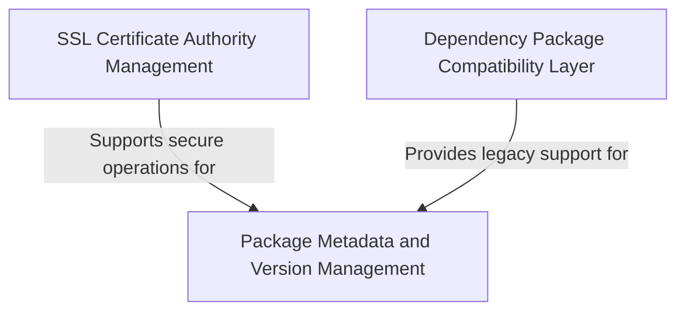

# Tutorial: requests

**Requests** is a popular Python library that makes it easy to send *HTTP requests* and interact with web services.
It provides a simple, human-friendly interface for making web requests like GET, POST, etc.
The library handles complex networking details automatically, including **SSL certificate verification** for secure connections,
and maintains *backwards compatibility* with older code by providing access to its underlying dependencies.

**Source Repository:** [https://github.com/psf/requests](https://github.com/psf/requests)

## Chapters

1. [Package Metadata and Version Management
](01_package_metadata_and_version_management_.md)
2. [SSL Certificate Authority Management
](02_ssl_certificate_authority_management_.md)
3. [Dependency Package Compatibility Layer
](03_dependency_package_compatibility_layer_.md)

---

Generated by [AI Codebase Knowledge Builder](https://github.com/The-Pocket/Tutorial-Codebase-Knowledge)